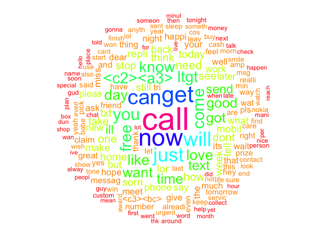

Filtering mobile phone spam with the Naive Bayes algorithm
================
November 02, 2018

Information
===========

-   Example – filtering mobile phone spam with the Naive Bayes algorithm
-   Data downloaded from <http://www.dt.fee.unicamp.br/~tiago/smsspamcollection/smsspamcollection.zip>.
-   将数据另存为sms\_spam.csv

Step 1. Prepare data
--------------------

-   读取数据

``` r
sms_raw <- read.csv("smsspamcollection/sms_spam.csv", stringsAsFactors = FALSE)
sms_raw$type <- factor(sms_raw$type)

str(sms_raw)
```

    ## 'data.frame':    5572 obs. of  2 variables:
    ##  $ type: Factor w/ 2 levels "ham","spam": 1 1 2 1 1 2 1 1 2 2 ...
    ##  $ text: chr  "Go until jurong point, crazy.. Available only in bugis n great world la e buffet... Cine there got amore wat..." "Ok lar... Joking wif u oni..." "Free entry in 2 a wkly comp to win FA Cup final tkts 21st May 2005. Text FA to 87121 to receive entry question("| __truncated__ "U dun say so early hor... U c already then say..." ...

-   Cleaning and standardizing text data

``` r
library(SnowballC)
library(tm)
```

    ## Loading required package: NLP

``` r
sms_corpus <- VCorpus(VectorSource(sms_raw$text))

sms_corpus_clean <- tm_map(sms_corpus, content_transformer(tolower))
sms_corpus_clean <- tm_map(sms_corpus, removeNumbers)
sms_corpus_clean <- tm_map(sms_corpus_clean, removeWords, stopwords())
sms_corpus_clean <- tm_map(sms_corpus_clean, removePunctuation)

sms_corpus_clean <- tm_map(sms_corpus_clean, stemDocument)
sms_corpus_clean <- tm_map(sms_corpus_clean, stripWhitespace)

sms_corpus_clean2 <- lapply(sms_corpus_clean[1:5572], as.character)
as.character(sms_corpus_clean2[1:3])
```

    ## [1] "Go jurong point crazi Availabl bugi n great world la e buffet Cine got amor wat"                      
    ## [2] "Ok lar Joke wif u oni"                                                                                
    ## [3] "Free entri wkli comp win FA Cup final tkts st May Text FA receiv entri questionstd txt rateTC appli s"

-   Splitting text documents into words

``` r
sms_dtm <- DocumentTermMatrix(sms_corpus_clean)
sms_dtm
```

    ## <<DocumentTermMatrix (documents: 5572, terms: 6960)>>
    ## Non-/sparse entries: 45812/38735308
    ## Sparsity           : 100%
    ## Maximal term length: 45
    ## Weighting          : term frequency (tf)

-   Creating training and test datasets

``` r
sms_dtm_train <- sms_dtm[1:4169, ]
sms_dtm_test <- sms_dtm[4170:5559, ]

sms_train_labels <- sms_raw[1:4169, ]$type
sms_test_labels <- sms_raw[4170:5559, ]$type

prop.table(table(sms_train_labels))
```

    ## sms_train_labels
    ##       ham      spam 
    ## 0.8647158 0.1352842

``` r
prop.table(table(sms_test_labels))
```

    ## sms_test_labels
    ##       ham      spam 
    ## 0.8697842 0.1302158

-   Visualizing text data – word clouds

``` r
library(wordcloud)
```

    ## Loading required package: RColorBrewer

``` r
wordcloud(sms_corpus_clean, min.freq = 50, random.order = F, colors = rainbow(10))
```



-   Visualizing spam word clouds

``` r
# ham <- subset(sms_raw, type == 'ham') wordcloud(ham$text, max.words = 40,
# scale = c(3, 0.5), colors = rainbow(10))

spam <- subset(sms_raw, type == "spam")
wordcloud(spam$text, max.words = 40, scale = c(3, 0.5), colors = rainbow(10))
```


Step 2. Training a model on the data
------------------------------------

-   Creating indicator features for frequent words

``` r
sms_freq_words <- findFreqTerms(sms_dtm_train, 5)
sms_dtm_freq_train <- sms_dtm_train[, sms_freq_words]
sms_dtm_freq_test <- sms_dtm_test[, sms_freq_words]

convert_counts <- function(x) {
    x <- ifelse(x > 0, "Yes", "No")
}

sms_train <- apply(sms_dtm_freq_train, MARGIN = 2, convert_counts)
sms_test <- apply(sms_dtm_freq_test, MARGIN = 2, convert_counts)

library(e1071)
sms_classifier <- naiveBayes(sms_train, sms_train_labels)
```

Step 3. Evaluating model performance
------------------------------------

``` r
sms_test_pred <- predict(sms_classifier, sms_test)
library(gmodels)
CrossTable(sms_test_pred, sms_test_labels, prop.chisq = FALSE, prop.t = FALSE, 
    dnn = c("predicted", "actual"))
```

    ## 
    ##  
    ##    Cell Contents
    ## |-------------------------|
    ## |                       N |
    ## |           N / Row Total |
    ## |           N / Col Total |
    ## |-------------------------|
    ## 
    ##  
    ## Total Observations in Table:  1390 
    ## 
    ##  
    ##              | actual 
    ##    predicted |       ham |      spam | Row Total | 
    ## -------------|-----------|-----------|-----------|
    ##          ham |      1202 |        20 |      1222 | 
    ##              |     0.984 |     0.016 |     0.879 | 
    ##              |     0.994 |     0.110 |           | 
    ## -------------|-----------|-----------|-----------|
    ##         spam |         7 |       161 |       168 | 
    ##              |     0.042 |     0.958 |     0.121 | 
    ##              |     0.006 |     0.890 |           | 
    ## -------------|-----------|-----------|-----------|
    ## Column Total |      1209 |       181 |      1390 | 
    ##              |     0.870 |     0.130 |           | 
    ## -------------|-----------|-----------|-----------|
    ## 
    ## 

Step 4. Improving model performance
-----------------------------------

``` r
sms_classifier2 <- naiveBayes(sms_train, sms_train_labels, laplace = 1)
sms_test_pred2 <- predict(sms_classifier2, sms_test)

CrossTable(sms_test_pred2, sms_test_labels, prop.chisq = FALSE, prop.t = FALSE, 
    prop.r = FALSE, dnn = c("predicted", "actual"))
```

    ## 
    ##  
    ##    Cell Contents
    ## |-------------------------|
    ## |                       N |
    ## |           N / Col Total |
    ## |-------------------------|
    ## 
    ##  
    ## Total Observations in Table:  1390 
    ## 
    ##  
    ##              | actual 
    ##    predicted |       ham |      spam | Row Total | 
    ## -------------|-----------|-----------|-----------|
    ##          ham |      1203 |        21 |      1224 | 
    ##              |     0.995 |     0.116 |           | 
    ## -------------|-----------|-----------|-----------|
    ##         spam |         6 |       160 |       166 | 
    ##              |     0.005 |     0.884 |           | 
    ## -------------|-----------|-----------|-----------|
    ## Column Total |      1209 |       181 |      1390 | 
    ##              |     0.870 |     0.130 |           | 
    ## -------------|-----------|-----------|-----------|
    ## 
    ##
