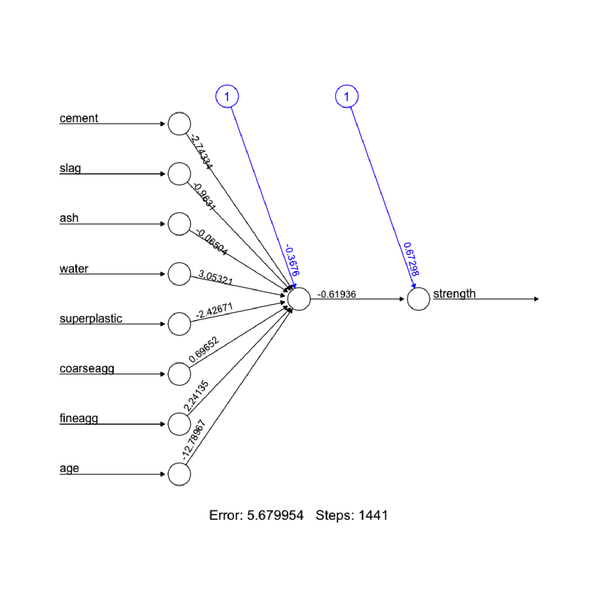
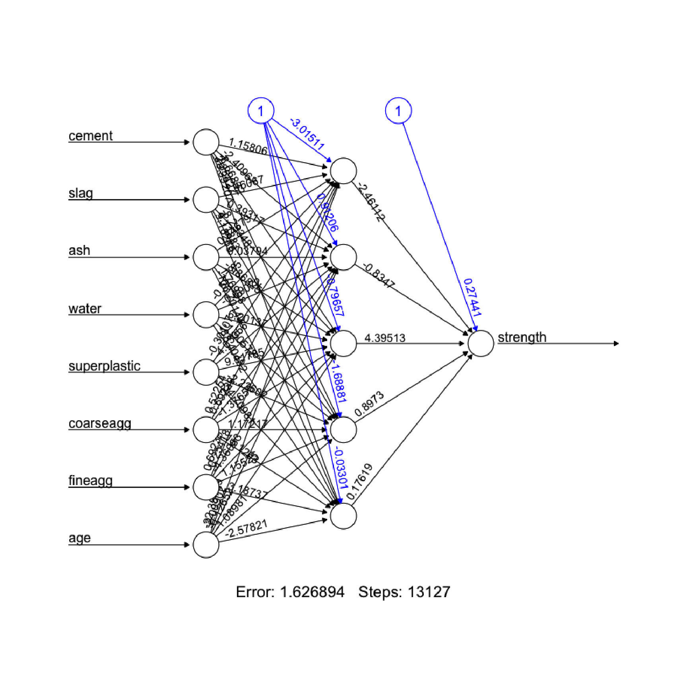

Neural Network: Modeling the strength of concrete with ANNs
================
November 17, 2018

Information
===========

-   数据获取 <https://github.com/stedy/Machine-Learning-with-R-datasets>
-   R markdown整理 <https://github.com/yi1873/machine_learning>

Step 1. Prepare data
--------------------

-   读取数据

``` r
concrete <- read.csv("../data/concrete.csv")

str(concrete)
```

    ## 'data.frame':    1030 obs. of  9 variables:
    ##  $ cement      : num  540 540 332 332 199 ...
    ##  $ slag        : num  0 0 142 142 132 ...
    ##  $ ash         : num  0 0 0 0 0 0 0 0 0 0 ...
    ##  $ water       : num  162 162 228 228 192 228 228 228 228 228 ...
    ##  $ superplastic: num  2.5 2.5 0 0 0 0 0 0 0 0 ...
    ##  $ coarseagg   : num  1040 1055 932 932 978 ...
    ##  $ fineagg     : num  676 676 594 594 826 ...
    ##  $ age         : int  28 28 270 365 360 90 365 28 28 28 ...
    ##  $ strength    : num  80 61.9 40.3 41 44.3 ...

``` r
normalize <- function(x) {
    return((x - min(x))/(max(x) - min(x)))
}
concrete_norm <- as.data.frame(lapply(concrete, normalize))
summary(concrete_norm$strength)
```

    ##    Min. 1st Qu.  Median    Mean 3rd Qu.    Max. 
    ##  0.0000  0.2664  0.4001  0.4172  0.5457  1.0000

``` r
summary(concrete$strength)
```

    ##    Min. 1st Qu.  Median    Mean 3rd Qu.    Max. 
    ##    2.33   23.71   34.45   35.82   46.13   82.60

Step 2. Training a model on the data
------------------------------------

``` r
library(neuralnet)

concrete_train <- concrete_norm[1:773, ] 
concrete_test <- concrete_norm[774:1030, ]

concrete_model <- neuralnet(strength ~ cement + slag + ash + water + superplastic + coarseagg + fineagg + age, data=concrete_train)

plot(concrete_model)
```


<p class="caption">
Fig 1. Neural network model
</p>

Step 3. Evaluating model performance
------------------------------------

``` r
model_results <- compute(concrete_model, concrete_test[1:8])
predicted_strength <- model_results$net.result
cor(predicted_strength, concrete_test$strength)
```

    ##              [,1]
    ## [1,] 0.7132987221

Step 4. Improving model performance
-----------------------------------

``` r
concrete_model2 <- neuralnet(strength ~ cement + slag + ash + water + superplastic + 
    coarseagg + fineagg + age, data = concrete_train, hidden = 5)
plot(concrete_model2)
```


<p class="caption">
Fig 2. Improved model
</p>

``` r
model_results2 <- compute(concrete_model2, concrete_test[1:8]) 
predicted_strength2 <- model_results2$net.result 
cor(predicted_strength2, concrete_test$strength)
```

    ##              [,1]
    ## [1,] 0.8022898973
