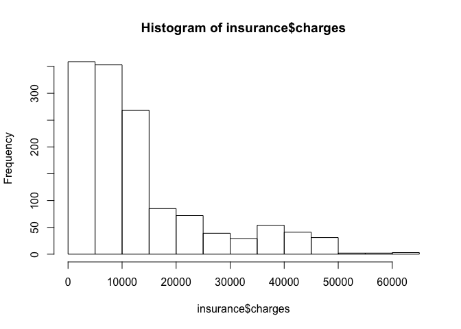
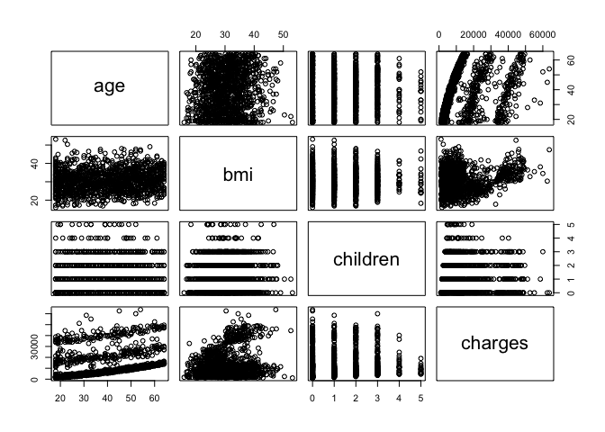
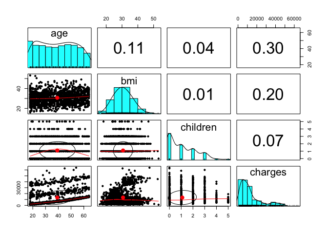

Predicting medical expenses using linear regression
================
<xiang_zhi_@126.com>
November 11, 2018

Information
===========

-   数据获取 <https://github.com/stedy/Machine-Learning-with-R-datasets>
-   R markdown整理 <https://github.com/yi1873/machine_learning>

Step 1. Prepare data
--------------------

-   读取数据

``` r
insurance <- read.csv("../data/insurance.csv", stringsAsFactors = TRUE)

str(insurance)
```

    ## 'data.frame':    1338 obs. of  7 variables:
    ##  $ age     : int  19 18 28 33 32 31 46 37 37 60 ...
    ##  $ sex     : Factor w/ 2 levels "female","male": 1 2 2 2 2 1 1 1 2 1 ...
    ##  $ bmi     : num  27.9 33.8 33 22.7 28.9 ...
    ##  $ children: int  0 1 3 0 0 0 1 3 2 0 ...
    ##  $ smoker  : Factor w/ 2 levels "no","yes": 2 1 1 1 1 1 1 1 1 1 ...
    ##  $ region  : Factor w/ 4 levels "northeast","northwest",..: 4 3 3 2 2 3 3 2 1 2 ...
    ##  $ charges : num  16885 1726 4449 21984 3867 ...

``` r
summary(insurance$charges)
```

    ##    Min. 1st Qu.  Median    Mean 3rd Qu.    Max. 
    ##    1122    4740    9382   13270   16640   63770

``` r
hist(insurance$charges)
```



``` r
table(insurance$region)
```

    ## 
    ## northeast northwest southeast southwest 
    ##       324       325       364       325

-   Exploring relationships among features – the correlation matrix

``` r
cor(insurance[c("age", "bmi", "children", "charges")])
```

    ##                age       bmi   children    charges
    ## age      1.0000000 0.1092719 0.04246900 0.29900819
    ## bmi      0.1092719 1.0000000 0.01275890 0.19834097
    ## children 0.0424690 0.0127589 1.00000000 0.06799823
    ## charges  0.2990082 0.1983410 0.06799823 1.00000000

-   Visualizing relationships among features – the scatterplot matrix

``` r
pairs(insurance[c("age", "bmi", "children", "charges")])

library(psych)
```



``` r
pairs.panels(insurance[c("age", "bmi", "children", "charges")])
```



Step 2. Training a model on the data
------------------------------------

``` r
ins_model <- lm(charges ~ age + children + bmi + sex + smoker + region, data = insurance)

ins_model <- lm(charges ~ ., data = insurance)
ins_model
```

    ## 
    ## Call:
    ## lm(formula = charges ~ ., data = insurance)
    ## 
    ## Coefficients:
    ##     (Intercept)              age          sexmale              bmi  
    ##        -11938.5            256.9           -131.3            339.2  
    ##        children        smokeryes  regionnorthwest  regionsoutheast  
    ##           475.5          23848.5           -353.0          -1035.0  
    ## regionsouthwest  
    ##          -960.1

Step 3. Evaluating model performance
------------------------------------

``` r
summary(ins_model)
```

    ## 
    ## Call:
    ## lm(formula = charges ~ ., data = insurance)
    ## 
    ## Residuals:
    ##      Min       1Q   Median       3Q      Max 
    ## -11304.9  -2848.1   -982.1   1393.9  29992.8 
    ## 
    ## Coefficients:
    ##                 Estimate Std. Error t value Pr(>|t|)    
    ## (Intercept)     -11938.5      987.8 -12.086  < 2e-16 ***
    ## age                256.9       11.9  21.587  < 2e-16 ***
    ## sexmale           -131.3      332.9  -0.394 0.693348    
    ## bmi                339.2       28.6  11.860  < 2e-16 ***
    ## children           475.5      137.8   3.451 0.000577 ***
    ## smokeryes        23848.5      413.1  57.723  < 2e-16 ***
    ## regionnorthwest   -353.0      476.3  -0.741 0.458769    
    ## regionsoutheast  -1035.0      478.7  -2.162 0.030782 *  
    ## regionsouthwest   -960.0      477.9  -2.009 0.044765 *  
    ## ---
    ## Signif. codes:  0 '***' 0.001 '**' 0.01 '*' 0.05 '.' 0.1 ' ' 1
    ## 
    ## Residual standard error: 6062 on 1329 degrees of freedom
    ## Multiple R-squared:  0.7509, Adjusted R-squared:  0.7494 
    ## F-statistic: 500.8 on 8 and 1329 DF,  p-value: < 2.2e-16

Step 4. Improving model performance
-----------------------------------

-   Model specification – adding non-linear relationships

``` r
insurance$age2 <- insurance$age^2
insurance$bmi30 <- ifelse(insurance$bmi >= 30, 1, 0)
ins_model2 <- lm(charges ~ age + age2 + children + bmi + sex + bmi30 * smoker + 
    region, data = insurance)
summary(ins_model2)
```

    ## 
    ## Call:
    ## lm(formula = charges ~ age + age2 + children + bmi + sex + bmi30 * 
    ##     smoker + region, data = insurance)
    ## 
    ## Residuals:
    ##      Min       1Q   Median       3Q      Max 
    ## -17296.4  -1656.0  -1263.3   -722.1  24160.2 
    ## 
    ## Coefficients:
    ##                   Estimate Std. Error t value Pr(>|t|)    
    ## (Intercept)       134.2509  1362.7511   0.099 0.921539    
    ## age               -32.6851    59.8242  -0.546 0.584915    
    ## age2                3.7316     0.7463   5.000 6.50e-07 ***
    ## children          678.5612   105.8831   6.409 2.04e-10 ***
    ## bmi               120.0196    34.2660   3.503 0.000476 ***
    ## sexmale          -496.8245   244.3659  -2.033 0.042240 *  
    ## bmi30           -1000.1403   422.8402  -2.365 0.018159 *  
    ## smokeryes       13404.6866   439.9491  30.469  < 2e-16 ***
    ## regionnorthwest  -279.2038   349.2746  -0.799 0.424212    
    ## regionsoutheast  -828.5467   351.6352  -2.356 0.018604 *  
    ## regionsouthwest -1222.6437   350.5285  -3.488 0.000503 ***
    ## bmi30:smokeryes 19810.7533   604.6567  32.764  < 2e-16 ***
    ## ---
    ## Signif. codes:  0 '***' 0.001 '**' 0.01 '*' 0.05 '.' 0.1 ' ' 1
    ## 
    ## Residual standard error: 4445 on 1326 degrees of freedom
    ## Multiple R-squared:  0.8664, Adjusted R-squared:  0.8653 
    ## F-statistic: 781.7 on 11 and 1326 DF,  p-value: < 2.2e-16
