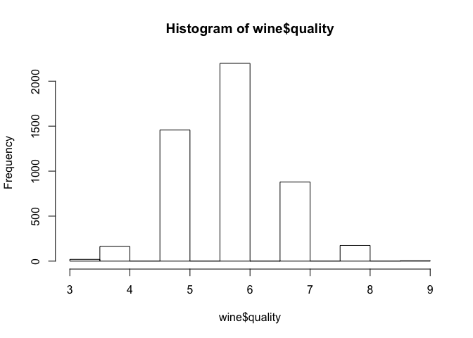
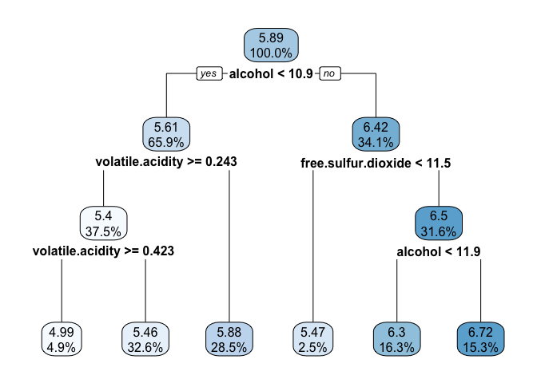
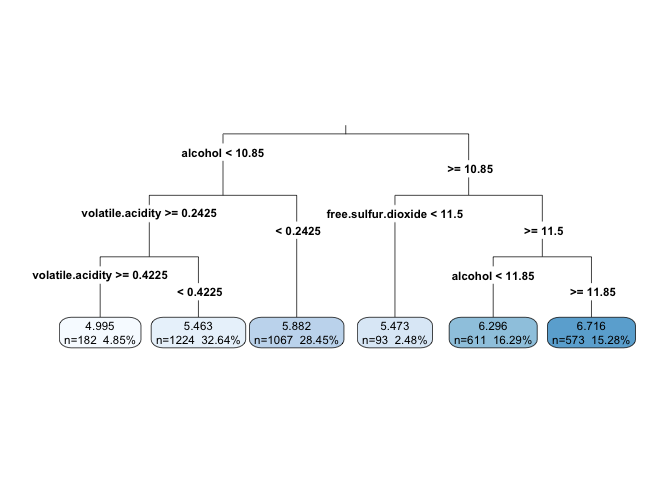

Estimating the quality of wines with regression trees and model trees
================
<xiang_zhi_@126.com>
November 11, 2018

Information
===========

-   数据获取 <https://github.com/stedy/Machine-Learning-with-R-datasets>
-   R markdown整理 <https://github.com/yi1873/machine_learning>

Step 1. Prepare data
--------------------

-   读取数据

``` r
wine <- read.csv("../data/whitewines.csv")

str(wine)
```

    ## 'data.frame':    4898 obs. of  12 variables:
    ##  $ fixed.acidity       : num  7 6.3 8.1 7.2 7.2 8.1 6.2 7 6.3 8.1 ...
    ##  $ volatile.acidity    : num  0.27 0.3 0.28 0.23 0.23 0.28 0.32 0.27 0.3 0.22 ...
    ##  $ citric.acid         : num  0.36 0.34 0.4 0.32 0.32 0.4 0.16 0.36 0.34 0.43 ...
    ##  $ residual.sugar      : num  20.7 1.6 6.9 8.5 8.5 6.9 7 20.7 1.6 1.5 ...
    ##  $ chlorides           : num  0.045 0.049 0.05 0.058 0.058 0.05 0.045 0.045 0.049 0.044 ...
    ##  $ free.sulfur.dioxide : num  45 14 30 47 47 30 30 45 14 28 ...
    ##  $ total.sulfur.dioxide: num  170 132 97 186 186 97 136 170 132 129 ...
    ##  $ density             : num  1.001 0.994 0.995 0.996 0.996 ...
    ##  $ pH                  : num  3 3.3 3.26 3.19 3.19 3.26 3.18 3 3.3 3.22 ...
    ##  $ sulphates           : num  0.45 0.49 0.44 0.4 0.4 0.44 0.47 0.45 0.49 0.45 ...
    ##  $ alcohol             : num  8.8 9.5 10.1 9.9 9.9 10.1 9.6 8.8 9.5 11 ...
    ##  $ quality             : int  6 6 6 6 6 6 6 6 6 6 ...

``` r
hist(wine$quality)
```



Step 2. Training a model on the data
------------------------------------

``` r
library(rpart)

wine_train <- wine[1:3750, ]
wine_test <- wine[3751:4898, ]

m.rpart <- rpart(quality ~ ., data = wine_train)
m.rpart
```

    ## n= 3750 
    ## 
    ## node), split, n, deviance, yval
    ##       * denotes terminal node
    ## 
    ##  1) root 3750 3140.06000 5.886933  
    ##    2) alcohol< 10.85 2473 1510.66200 5.609381  
    ##      4) volatile.acidity>=0.2425 1406  740.15080 5.402560  
    ##        8) volatile.acidity>=0.4225 182   92.99451 4.994505 *
    ##        9) volatile.acidity< 0.4225 1224  612.34560 5.463235 *
    ##      5) volatile.acidity< 0.2425 1067  631.12090 5.881912 *
    ##    3) alcohol>=10.85 1277 1069.95800 6.424432  
    ##      6) free.sulfur.dioxide< 11.5 93   99.18280 5.473118 *
    ##      7) free.sulfur.dioxide>=11.5 1184  879.99920 6.499155  
    ##       14) alcohol< 11.85 611  447.38130 6.296236 *
    ##       15) alcohol>=11.85 573  380.63180 6.715532 *

-   Visualizing decision trees

``` r
library(rpart.plot)

rpart.plot(m.rpart, digits = 3)
```



``` r
rpart.plot(m.rpart, digits = 4, fallen.leaves = TRUE, type = 3, extra = 101)
```



Step 3. Evaluating model performance
------------------------------------

``` r
p.rpart <- predict(m.rpart, wine_test)
summary(p.rpart)
```

    ##    Min. 1st Qu.  Median    Mean 3rd Qu.    Max. 
    ##   4.995   5.463   5.882   5.999   6.296   6.716

``` r
summary(wine_test$quality)
```

    ##    Min. 1st Qu.  Median    Mean 3rd Qu.    Max. 
    ##   3.000   5.000   6.000   5.848   6.000   8.000

``` r
cor(p.rpart, wine_test$quality)
```

    ## [1] 0.4931608

-   Measuring performance with the mean absolute error

``` r
MAE <- function(actual, predicted) {
    mean(abs(actual - predicted))
}

MAE(p.rpart, wine_test$quality)
```

    ## [1] 0.5732104

``` r
MAE(mean(wine_train$quality), wine_test$quality)
```

    ## [1] 0.5752548

Step 4. Improving model performance
-----------------------------------

-   Model specification – adding non-linear relationships

``` r
library(RWeka)
m.m5p <- M5P(quality ~ ., data = wine_train)
m.m5p
```

    ## M5 pruned model tree:
    ## (using smoothed linear models)
    ## 
    ## alcohol <= 10.85 : 
    ## |   volatile.acidity <= 0.282 : 
    ## |   |   volatile.acidity <= 0.207 : 
    ## |   |   |   residual.sugar <= 10.1 : 
    ## |   |   |   |   alcohol <= 10.15 : 
    ## |   |   |   |   |   citric.acid <= 0.275 : LM1 (66/46.178%)
    ## |   |   |   |   |   citric.acid >  0.275 : 
    ## |   |   |   |   |   |   fixed.acidity <= 7.45 : 
    ## |   |   |   |   |   |   |   alcohol <= 9.85 : LM2 (89/64.134%)
    ## |   |   |   |   |   |   |   alcohol >  9.85 : 
    ## |   |   |   |   |   |   |   |   density <= 0.993 : 
    ## |   |   |   |   |   |   |   |   |   fixed.acidity <= 6.6 : LM3 (7/0%)
    ## |   |   |   |   |   |   |   |   |   fixed.acidity >  6.6 : LM4 (13/49.88%)
    ## |   |   |   |   |   |   |   |   density >  0.993 : 
    ## |   |   |   |   |   |   |   |   |   residual.sugar <= 1.85 : LM5 (5/0%)
    ## |   |   |   |   |   |   |   |   |   residual.sugar >  1.85 : LM6 (7/15.602%)
    ## |   |   |   |   |   |   fixed.acidity >  7.45 : LM7 (59/74.093%)
    ## |   |   |   |   alcohol >  10.15 : LM8 (214/81.981%)
    ## |   |   |   residual.sugar >  10.1 : 
    ## |   |   |   |   citric.acid <= 0.305 : 
    ## |   |   |   |   |   citric.acid <= 0.275 : LM9 (15/50.102%)
    ## |   |   |   |   |   citric.acid >  0.275 : 
    ## |   |   |   |   |   |   free.sulfur.dioxide <= 30.5 : LM10 (14/0%)
    ## |   |   |   |   |   |   free.sulfur.dioxide >  30.5 : 
    ## |   |   |   |   |   |   |   chlorides <= 0.055 : 
    ## |   |   |   |   |   |   |   |   free.sulfur.dioxide <= 51.25 : 
    ## |   |   |   |   |   |   |   |   |   density <= 0.997 : 
    ## |   |   |   |   |   |   |   |   |   |   residual.sugar <= 10.35 : LM11 (3/0%)
    ## |   |   |   |   |   |   |   |   |   |   residual.sugar >  10.35 : LM12 (3/0%)
    ## |   |   |   |   |   |   |   |   |   density >  0.997 : LM13 (8/0%)
    ## |   |   |   |   |   |   |   |   free.sulfur.dioxide >  51.25 : LM14 (6/0%)
    ## |   |   |   |   |   |   |   chlorides >  0.055 : LM15 (6/0%)
    ## |   |   |   |   citric.acid >  0.305 : 
    ## |   |   |   |   |   citric.acid <= 0.435 : 
    ## |   |   |   |   |   |   chlorides <= 0.052 : 
    ## |   |   |   |   |   |   |   density <= 0.997 : 
    ## |   |   |   |   |   |   |   |   sulphates <= 0.57 : LM16 (11/18.751%)
    ## |   |   |   |   |   |   |   |   sulphates >  0.57 : LM17 (6/0%)
    ## |   |   |   |   |   |   |   density >  0.997 : 
    ## |   |   |   |   |   |   |   |   density <= 0.999 : LM18 (22/0%)
    ## |   |   |   |   |   |   |   |   density >  0.999 : LM19 (6/28.153%)
    ## |   |   |   |   |   |   chlorides >  0.052 : LM20 (13/0%)
    ## |   |   |   |   |   citric.acid >  0.435 : 
    ## |   |   |   |   |   |   citric.acid <= 0.495 : 
    ## |   |   |   |   |   |   |   pH <= 3.205 : LM21 (10/38.853%)
    ## |   |   |   |   |   |   |   pH >  3.205 : 
    ## |   |   |   |   |   |   |   |   fixed.acidity <= 7.55 : LM22 (3/0%)
    ## |   |   |   |   |   |   |   |   fixed.acidity >  7.55 : LM23 (3/0%)
    ## |   |   |   |   |   |   citric.acid >  0.495 : 
    ## |   |   |   |   |   |   |   free.sulfur.dioxide <= 51.5 : LM24 (12/0%)
    ## |   |   |   |   |   |   |   free.sulfur.dioxide >  51.5 : 
    ## |   |   |   |   |   |   |   |   citric.acid <= 0.67 : LM25 (2/0%)
    ## |   |   |   |   |   |   |   |   citric.acid >  0.67 : LM26 (5/0%)
    ## |   |   volatile.acidity >  0.207 : 
    ## |   |   |   alcohol <= 9.95 : 
    ## |   |   |   |   citric.acid <= 0.265 : 
    ## |   |   |   |   |   chlorides <= 0.046 : 
    ## |   |   |   |   |   |   residual.sugar <= 6.25 : 
    ## |   |   |   |   |   |   |   chlorides <= 0.038 : LM27 (5/0%)
    ## |   |   |   |   |   |   |   chlorides >  0.038 : 
    ## |   |   |   |   |   |   |   |   density <= 0.994 : LM28 (5/0%)
    ## |   |   |   |   |   |   |   |   density >  0.994 : 
    ## |   |   |   |   |   |   |   |   |   volatile.acidity <= 0.253 : LM29 (2/0%)
    ## |   |   |   |   |   |   |   |   |   volatile.acidity >  0.253 : LM30 (2/0%)
    ## |   |   |   |   |   |   residual.sugar >  6.25 : LM31 (51/40.682%)
    ## |   |   |   |   |   chlorides >  0.046 : 
    ## |   |   |   |   |   |   chlorides <= 0.057 : 
    ## |   |   |   |   |   |   |   pH <= 3.18 : LM32 (24/0%)
    ## |   |   |   |   |   |   |   pH >  3.18 : LM33 (24/48.999%)
    ## |   |   |   |   |   |   chlorides >  0.057 : LM34 (27/78.724%)
    ## |   |   |   |   citric.acid >  0.265 : 
    ## |   |   |   |   |   citric.acid <= 0.425 : 
    ## |   |   |   |   |   |   total.sulfur.dioxide <= 146.5 : 
    ## |   |   |   |   |   |   |   density <= 1 : 
    ## |   |   |   |   |   |   |   |   total.sulfur.dioxide <= 115.5 : 
    ## |   |   |   |   |   |   |   |   |   pH <= 3.175 : 
    ## |   |   |   |   |   |   |   |   |   |   density <= 0.996 : LM35 (14/0%)
    ## |   |   |   |   |   |   |   |   |   |   density >  0.996 : 
    ## |   |   |   |   |   |   |   |   |   |   |   citric.acid <= 0.305 : LM36 (2/0%)
    ## |   |   |   |   |   |   |   |   |   |   |   citric.acid >  0.305 : LM37 (3/0%)
    ## |   |   |   |   |   |   |   |   |   pH >  3.175 : 
    ## |   |   |   |   |   |   |   |   |   |   residual.sugar <= 1.1 : LM38 (2/0%)
    ## |   |   |   |   |   |   |   |   |   |   residual.sugar >  1.1 : LM39 (6/0%)
    ## |   |   |   |   |   |   |   |   total.sulfur.dioxide >  115.5 : 
    ## |   |   |   |   |   |   |   |   |   free.sulfur.dioxide <= 24.5 : LM40 (12/30.204%)
    ## |   |   |   |   |   |   |   |   |   free.sulfur.dioxide >  24.5 : 
    ## |   |   |   |   |   |   |   |   |   |   volatile.acidity <= 0.235 : 
    ## |   |   |   |   |   |   |   |   |   |   |   pH <= 3.085 : LM41 (9/0%)
    ## |   |   |   |   |   |   |   |   |   |   |   pH >  3.085 : 
    ## |   |   |   |   |   |   |   |   |   |   |   |   residual.sugar <= 16.75 : 
    ## |   |   |   |   |   |   |   |   |   |   |   |   |   residual.sugar <= 9.65 : LM42 (4/0%)
    ## |   |   |   |   |   |   |   |   |   |   |   |   |   residual.sugar >  9.65 : LM43 (7/0%)
    ## |   |   |   |   |   |   |   |   |   |   |   |   residual.sugar >  16.75 : LM44 (5/0%)
    ## |   |   |   |   |   |   |   |   |   |   volatile.acidity >  0.235 : 
    ## |   |   |   |   |   |   |   |   |   |   |   citric.acid <= 0.35 : LM45 (9/0%)
    ## |   |   |   |   |   |   |   |   |   |   |   citric.acid >  0.35 : LM46 (5/43.713%)
    ## |   |   |   |   |   |   |   density >  1 : 
    ## |   |   |   |   |   |   |   |   residual.sugar <= 15.05 : LM47 (5/58.835%)
    ## |   |   |   |   |   |   |   |   residual.sugar >  15.05 : LM48 (16/0%)
    ## |   |   |   |   |   |   total.sulfur.dioxide >  146.5 : 
    ## |   |   |   |   |   |   |   fixed.acidity <= 6.65 : LM49 (74/60.126%)
    ## |   |   |   |   |   |   |   fixed.acidity >  6.65 : 
    ## |   |   |   |   |   |   |   |   pH <= 3.145 : LM50 (102/68.399%)
    ## |   |   |   |   |   |   |   |   pH >  3.145 : LM51 (77/61.812%)
    ## |   |   |   |   |   citric.acid >  0.425 : LM52 (135/57.831%)
    ## |   |   |   alcohol >  9.95 : 
    ## |   |   |   |   free.sulfur.dioxide <= 27.5 : 
    ## |   |   |   |   |   free.sulfur.dioxide <= 13.5 : LM53 (33/98.682%)
    ## |   |   |   |   |   free.sulfur.dioxide >  13.5 : LM54 (86/62.63%)
    ## |   |   |   |   free.sulfur.dioxide >  27.5 : 
    ## |   |   |   |   |   pH <= 3.325 : 
    ## |   |   |   |   |   |   volatile.acidity <= 0.263 : 
    ## |   |   |   |   |   |   |   free.sulfur.dioxide <= 55.5 : LM55 (103/57.077%)
    ## |   |   |   |   |   |   |   free.sulfur.dioxide >  55.5 : 
    ## |   |   |   |   |   |   |   |   residual.sugar <= 8 : LM56 (15/40.324%)
    ## |   |   |   |   |   |   |   |   residual.sugar >  8 : 
    ## |   |   |   |   |   |   |   |   |   total.sulfur.dioxide <= 155 : 
    ## |   |   |   |   |   |   |   |   |   |   chlorides <= 0.039 : LM57 (2/0%)
    ## |   |   |   |   |   |   |   |   |   |   chlorides >  0.039 : LM58 (4/0%)
    ## |   |   |   |   |   |   |   |   |   total.sulfur.dioxide >  155 : LM59 (8/0%)
    ## |   |   |   |   |   |   volatile.acidity >  0.263 : 
    ## |   |   |   |   |   |   |   chlorides <= 0.044 : 
    ## |   |   |   |   |   |   |   |   total.sulfur.dioxide <= 130.5 : LM60 (5/30.588%)
    ## |   |   |   |   |   |   |   |   total.sulfur.dioxide >  130.5 : 
    ## |   |   |   |   |   |   |   |   |   density <= 0.992 : LM61 (3/0%)
    ## |   |   |   |   |   |   |   |   |   density >  0.992 : 
    ## |   |   |   |   |   |   |   |   |   |   fixed.acidity <= 6.85 : LM62 (4/0%)
    ## |   |   |   |   |   |   |   |   |   |   fixed.acidity >  6.85 : 
    ## |   |   |   |   |   |   |   |   |   |   |   free.sulfur.dioxide <= 30.5 : LM63 (2/0%)
    ## |   |   |   |   |   |   |   |   |   |   |   free.sulfur.dioxide >  30.5 : LM64 (4/22.369%)
    ## |   |   |   |   |   |   |   chlorides >  0.044 : 
    ## |   |   |   |   |   |   |   |   density <= 0.995 : LM65 (9/57.073%)
    ## |   |   |   |   |   |   |   |   density >  0.995 : LM66 (7/0%)
    ## |   |   |   |   |   pH >  3.325 : LM67 (72/73.853%)
    ## |   volatile.acidity >  0.282 : 
    ## |   |   volatile.acidity <= 0.422 : 
    ## |   |   |   free.sulfur.dioxide <= 21.5 : LM68 (143/70.071%)
    ## |   |   |   free.sulfur.dioxide >  21.5 : 
    ## |   |   |   |   alcohol <= 9.25 : LM69 (188/55.598%)
    ## |   |   |   |   alcohol >  9.25 : 
    ## |   |   |   |   |   chlorides <= 0.04 : LM70 (94/71.599%)
    ## |   |   |   |   |   chlorides >  0.04 : 
    ## |   |   |   |   |   |   volatile.acidity <= 0.305 : LM71 (70/66.297%)
    ## |   |   |   |   |   |   volatile.acidity >  0.305 : 
    ## |   |   |   |   |   |   |   citric.acid <= 0.345 : LM72 (132/54.604%)
    ## |   |   |   |   |   |   |   citric.acid >  0.345 : 
    ## |   |   |   |   |   |   |   |   volatile.acidity <= 0.335 : 
    ## |   |   |   |   |   |   |   |   |   chlorides <= 0.044 : LM73 (7/37.561%)
    ## |   |   |   |   |   |   |   |   |   chlorides >  0.044 : LM74 (20/0%)
    ## |   |   |   |   |   |   |   |   volatile.acidity >  0.335 : 
    ## |   |   |   |   |   |   |   |   |   pH <= 3.15 : 
    ## |   |   |   |   |   |   |   |   |   |   volatile.acidity <= 0.375 : 
    ## |   |   |   |   |   |   |   |   |   |   |   pH <= 3.055 : LM75 (6/0%)
    ## |   |   |   |   |   |   |   |   |   |   |   pH >  3.055 : 
    ## |   |   |   |   |   |   |   |   |   |   |   |   sulphates <= 0.42 : LM76 (5/0%)
    ## |   |   |   |   |   |   |   |   |   |   |   |   sulphates >  0.42 : 
    ## |   |   |   |   |   |   |   |   |   |   |   |   |   pH <= 3.105 : LM77 (5/0%)
    ## |   |   |   |   |   |   |   |   |   |   |   |   |   pH >  3.105 : 
    ## |   |   |   |   |   |   |   |   |   |   |   |   |   |   volatile.acidity <= 0.355 : LM78 (2/0%)
    ## |   |   |   |   |   |   |   |   |   |   |   |   |   |   volatile.acidity >  0.355 : LM79 (2/0%)
    ## |   |   |   |   |   |   |   |   |   |   volatile.acidity >  0.375 : LM80 (10/0%)
    ## |   |   |   |   |   |   |   |   |   pH >  3.15 : 
    ## |   |   |   |   |   |   |   |   |   |   residual.sugar <= 9.45 : 
    ## |   |   |   |   |   |   |   |   |   |   |   density <= 0.996 : LM81 (4/0%)
    ## |   |   |   |   |   |   |   |   |   |   |   density >  0.996 : LM82 (4/0%)
    ## |   |   |   |   |   |   |   |   |   |   residual.sugar >  9.45 : LM83 (7/0%)
    ## |   |   volatile.acidity >  0.422 : 
    ## |   |   |   volatile.acidity <= 0.587 : 
    ## |   |   |   |   chlorides <= 0.049 : 
    ## |   |   |   |   |   residual.sugar <= 10.65 : LM84 (49/74.502%)
    ## |   |   |   |   |   residual.sugar >  10.65 : LM85 (17/56.041%)
    ## |   |   |   |   chlorides >  0.049 : LM86 (71/54.436%)
    ## |   |   |   volatile.acidity >  0.587 : LM87 (45/63.658%)
    ## alcohol >  10.85 : 
    ## |   free.sulfur.dioxide <= 20.5 : 
    ## |   |   free.sulfur.dioxide <= 10.5 : LM88 (81/104.574%)
    ## |   |   free.sulfur.dioxide >  10.5 : LM89 (224/87.002%)
    ## |   free.sulfur.dioxide >  20.5 : 
    ## |   |   alcohol <= 12.05 : 
    ## |   |   |   fixed.acidity <= 7.35 : 
    ## |   |   |   |   sulphates <= 0.565 : 
    ## |   |   |   |   |   residual.sugar <= 2.05 : 
    ## |   |   |   |   |   |   density <= 0.991 : LM90 (76/70.139%)
    ## |   |   |   |   |   |   density >  0.991 : LM91 (53/88.647%)
    ## |   |   |   |   |   residual.sugar >  2.05 : 
    ## |   |   |   |   |   |   free.sulfur.dioxide <= 38.5 : 
    ## |   |   |   |   |   |   |   total.sulfur.dioxide <= 125 : LM92 (66/68.756%)
    ## |   |   |   |   |   |   |   total.sulfur.dioxide >  125 : LM93 (39/85.617%)
    ## |   |   |   |   |   |   free.sulfur.dioxide >  38.5 : LM94 (77/74.028%)
    ## |   |   |   |   sulphates >  0.565 : LM95 (99/67.429%)
    ## |   |   |   fixed.acidity >  7.35 : 
    ## |   |   |   |   density <= 0.994 : LM96 (123/81.196%)
    ## |   |   |   |   density >  0.994 : LM97 (53/63.304%)
    ## |   |   alcohol >  12.05 : 
    ## |   |   |   sulphates <= 0.475 : 
    ## |   |   |   |   total.sulfur.dioxide <= 112.5 : 
    ## |   |   |   |   |   alcohol <= 12.55 : LM98 (56/55.393%)
    ## |   |   |   |   |   alcohol >  12.55 : 
    ## |   |   |   |   |   |   citric.acid <= 0.285 : 
    ## |   |   |   |   |   |   |   citric.acid <= 0.245 : LM99 (5/36.972%)
    ## |   |   |   |   |   |   |   citric.acid >  0.245 : LM100 (5/0%)
    ## |   |   |   |   |   |   citric.acid >  0.285 : 
    ## |   |   |   |   |   |   |   sulphates <= 0.415 : 
    ## |   |   |   |   |   |   |   |   free.sulfur.dioxide <= 34.5 : 
    ## |   |   |   |   |   |   |   |   |   alcohol <= 13.3 : 
    ## |   |   |   |   |   |   |   |   |   |   total.sulfur.dioxide <= 77.5 : LM101 (5/0%)
    ## |   |   |   |   |   |   |   |   |   |   total.sulfur.dioxide >  77.5 : LM102 (9/27.113%)
    ## |   |   |   |   |   |   |   |   |   alcohol >  13.3 : LM103 (4/47.32%)
    ## |   |   |   |   |   |   |   |   free.sulfur.dioxide >  34.5 : LM104 (5/0%)
    ## |   |   |   |   |   |   |   sulphates >  0.415 : 
    ## |   |   |   |   |   |   |   |   pH <= 3.225 : LM105 (4/9.044%)
    ## |   |   |   |   |   |   |   |   pH >  3.225 : LM106 (4/0%)
    ## |   |   |   |   total.sulfur.dioxide >  112.5 : 
    ## |   |   |   |   |   free.sulfur.dioxide <= 35.5 : LM107 (56/78.811%)
    ## |   |   |   |   |   free.sulfur.dioxide >  35.5 : LM108 (79/66.147%)
    ## |   |   |   sulphates >  0.475 : 
    ## |   |   |   |   citric.acid <= 0.345 : 
    ## |   |   |   |   |   pH <= 3.155 : LM109 (22/28.736%)
    ## |   |   |   |   |   pH >  3.155 : 
    ## |   |   |   |   |   |   residual.sugar <= 1.85 : LM110 (15/69.709%)
    ## |   |   |   |   |   |   residual.sugar >  1.85 : LM111 (59/58.202%)
    ## |   |   |   |   citric.acid >  0.345 : LM112 (58/78.288%)
    ## 
    ## LM num: 1
    ## quality = 
    ##  0.0496 * volatile.acidity 
    ##  - 0.1195 * citric.acid 
    ##  + 0.0803 * residual.sugar 
    ##  + 0.0388 * chlorides 
    ##  + 1.0289 * free.sulfur.dioxide 
    ##  + 0.0017 * total.sulfur.dioxide 
    ##  - 117.4688 * density 
    ##  - 87.6934 * pH 
    ##  + 1.2306 * sulphates 
    ##  + 0.4379 * alcohol 
    ##  + 207.4502
    ## 
    ## LM num: 2
    ## quality = 
    ##  0.0649 * volatile.acidity 
    ##  - 0.1195 * citric.acid 
    ##  - 0.0156 * residual.sugar 
    ##  + 0.0337 * chlorides 
    ##  + 0.6633 * free.sulfur.dioxide 
    ##  + 0.0038 * total.sulfur.dioxide 
    ##  - 0.0009 * density 
    ##  - 82.3489 * pH 
    ##  + 1.3566 * sulphates 
    ##  + 0.5559 * alcohol 
    ##  + 84.3863
    ## 
    ## LM num: 3
    ## quality = 
    ##  0.152 * fixed.acidity 
    ##  + 0.1047 * volatile.acidity 
    ##  - 0.1195 * citric.acid 
    ##  - 0.0156 * residual.sugar 
    ##  + 0.0391 * chlorides 
    ##  + 0.6633 * free.sulfur.dioxide 
    ##  + 0.0054 * total.sulfur.dioxide 
    ##  - 85.756 * density 
    ##  - 103.5429 * pH 
    ##  + 0.5226 * sulphates 
    ##  + 0.757 * alcohol 
    ##  + 191.2577
    ## 
    ## LM num: 4
    ## quality = 
    ##  0.1397 * fixed.acidity 
    ##  + 0.1047 * volatile.acidity 
    ##  - 0.1195 * citric.acid 
    ##  - 0.0156 * residual.sugar 
    ##  + 5.2812 * chlorides 
    ##  + 0.6633 * free.sulfur.dioxide 
    ##  + 0.0054 * total.sulfur.dioxide 
    ##  - 85.756 * density 
    ##  - 103.5429 * pH 
    ##  + 0.5226 * sulphates 
    ##  + 0.757 * alcohol 
    ##  + 191.1871
    ## 
    ## LM num: 5
    ## quality = 
    ##  0.1227 * fixed.acidity 
    ##  + 0.1047 * volatile.acidity 
    ##  - 0.1195 * citric.acid 
    ##  - 0.0156 * residual.sugar 
    ##  + 0.0391 * chlorides 
    ##  + 0.6633 * free.sulfur.dioxide 
    ##  + 0.0054 * total.sulfur.dioxide 
    ##  - 111.1648 * density 
    ##  - 103.5429 * pH 
    ##  + 0.5226 * sulphates 
    ##  + 0.757 * alcohol 
    ##  + 216.4052
    ## 
    ## LM num: 6
    ## quality = 
    ##  0.1227 * fixed.acidity 
    ##  + 0.1047 * volatile.acidity 
    ##  - 4.9064 * citric.acid 
    ##  - 0.0156 * residual.sugar 
    ##  + 0.0391 * chlorides 
    ##  + 0.6633 * free.sulfur.dioxide 
    ##  + 0.0043 * total.sulfur.dioxide 
    ##  - 111.1648 * density 
    ##  - 103.5429 * pH 
    ##  + 0.5226 * sulphates 
    ##  + 0.757 * alcohol 
    ##  + 218.1117
    ## 
    ## LM num: 7
    ## quality = 
    ##  -0.2034 * fixed.acidity 
    ##  + 0.032 * volatile.acidity 
    ##  - 0.1195 * citric.acid 
    ##  - 0.0156 * residual.sugar 
    ##  + 0.0335 * chlorides 
    ##  + 0.6727 * free.sulfur.dioxide 
    ##  + 0.0039 * total.sulfur.dioxide 
    ##  - 0.0008 * density 
    ##  - 77.0631 * pH 
    ##  + 0.4009 * sulphates 
    ##  + 0.4942 * alcohol 
    ##  + 81.8479
    ## 
    ## LM num: 8
    ## quality = 
    ##  0.0209 * volatile.acidity 
    ##  - 0.1195 * citric.acid 
    ##  - 0.0156 * residual.sugar 
    ##  + 0.0146 * chlorides 
    ##  + 0.4346 * free.sulfur.dioxide 
    ##  + 0.0006 * total.sulfur.dioxide 
    ##  - 0.0001 * density 
    ##  - 29.7968 * pH 
    ##  + 0.1267 * sulphates 
    ##  + 0.1532 * alcohol 
    ##  + 34.9695
    ## 
    ## LM num: 9
    ## quality = 
    ##  0.5123 * fixed.acidity 
    ##  + 6.1308 * volatile.acidity 
    ##  + 2.6439 * citric.acid 
    ##  - 0.0455 * residual.sugar 
    ##  + 0.0145 * chlorides 
    ##  + 0.4099 * free.sulfur.dioxide 
    ##  + 0 * total.sulfur.dioxide 
    ##  + 0 * density 
    ##  - 27.6843 * pH 
    ##  + 0.1008 * sulphates 
    ##  + 0.1372 * alcohol 
    ##  + 28.2284
    ## 
    ## LM num: 10
    ## quality = 
    ##  0.2052 * fixed.acidity 
    ##  + 0.0196 * volatile.acidity 
    ##  + 1.2384 * citric.acid 
    ##  - 0.1119 * residual.sugar 
    ##  - 8.7167 * chlorides 
    ##  + 0.4088 * free.sulfur.dioxide 
    ##  + 0 * total.sulfur.dioxide 
    ##  + 127.8654 * density 
    ##  - 27.6843 * pH 
    ##  + 0.1008 * sulphates 
    ##  + 0.1372 * alcohol 
    ##  - 93.9949
    ## 
    ## LM num: 11
    ## quality = 
    ##  0.2052 * fixed.acidity 
    ##  + 0.0196 * volatile.acidity 
    ##  + 1.2384 * citric.acid 
    ##  - 0.1617 * residual.sugar 
    ##  - 6.1612 * chlorides 
    ##  + 0.4026 * free.sulfur.dioxide 
    ##  + 0 * total.sulfur.dioxide 
    ##  + 164.9383 * density 
    ##  - 27.6843 * pH 
    ##  + 0.1008 * sulphates 
    ##  + 0.1372 * alcohol 
    ##  - 130.1995
    ## 
    ## LM num: 12
    ## quality = 
    ##  0.2052 * fixed.acidity 
    ##  + 0.0196 * volatile.acidity 
    ##  + 1.2384 * citric.acid 
    ##  - 0.1617 * residual.sugar 
    ##  - 6.1612 * chlorides 
    ##  + 0.4026 * free.sulfur.dioxide 
    ##  + 0 * total.sulfur.dioxide 
    ##  + 164.9383 * density 
    ##  - 27.6843 * pH 
    ##  + 0.1008 * sulphates 
    ##  + 0.1372 * alcohol 
    ##  - 130.2078
    ## 
    ## LM num: 13
    ## quality = 
    ##  0.2052 * fixed.acidity 
    ##  + 0.0196 * volatile.acidity 
    ##  + 1.2384 * citric.acid 
    ##  - 0.1487 * residual.sugar 
    ##  - 6.1612 * chlorides 
    ##  + 0.4026 * free.sulfur.dioxide 
    ##  + 0 * total.sulfur.dioxide 
    ##  + 164.9383 * density 
    ##  - 27.6843 * pH 
    ##  + 0.1008 * sulphates 
    ##  + 0.1372 * alcohol 
    ##  - 130.3516
    ## 
    ## LM num: 14
    ## quality = 
    ##  0.2052 * fixed.acidity 
    ##  + 0.0196 * volatile.acidity 
    ##  + 1.2384 * citric.acid 
    ##  - 0.1374 * residual.sugar 
    ##  - 6.1612 * chlorides 
    ##  + 0.4015 * free.sulfur.dioxide 
    ##  + 0 * total.sulfur.dioxide 
    ##  + 172.5486 * density 
    ##  - 27.6843 * pH 
    ##  + 0.1008 * sulphates 
    ##  + 0.1372 * alcohol 
    ##  - 138.0831
    ## 
    ## LM num: 15
    ## quality = 
    ##  0.2052 * fixed.acidity 
    ##  + 0.0196 * volatile.acidity 
    ##  + 1.2384 * citric.acid 
    ##  - 0.135 * residual.sugar 
    ##  - 6.1612 * chlorides 
    ##  + 0.4025 * free.sulfur.dioxide 
    ##  + 0 * total.sulfur.dioxide 
    ##  + 181.3076 * density 
    ##  - 27.6843 * pH 
    ##  + 0.1008 * sulphates 
    ##  + 0.1372 * alcohol 
    ##  - 146.7274
    ## 
    ## LM num: 16
    ## quality = 
    ##  0.4254 * fixed.acidity 
    ##  + 1.0239 * volatile.acidity 
    ##  - 0.3325 * citric.acid 
    ##  - 0.0308 * residual.sugar 
    ##  + 0.0145 * chlorides 
    ##  + 0.416 * free.sulfur.dioxide 
    ##  + 0 * total.sulfur.dioxide 
    ##  - 58.9145 * density 
    ##  - 27.6843 * pH 
    ##  + 1.2124 * sulphates 
    ##  + 0.1372 * alcohol 
    ##  + 88.0625
    ## 
    ## LM num: 17
    ## quality = 
    ##  0.3275 * fixed.acidity 
    ##  + 1.0239 * volatile.acidity 
    ##  - 0.3325 * citric.acid 
    ##  - 0.0308 * residual.sugar 
    ##  + 0.0145 * chlorides 
    ##  + 0.416 * free.sulfur.dioxide 
    ##  + 0 * total.sulfur.dioxide 
    ##  - 58.9145 * density 
    ##  - 27.6843 * pH 
    ##  + 1.3728 * sulphates 
    ##  + 0.1372 * alcohol 
    ##  + 88.7343
    ## 
    ## LM num: 18
    ## quality = 
    ##  0.1428 * fixed.acidity 
    ##  + 0.767 * volatile.acidity 
    ##  - 0.3325 * citric.acid 
    ##  - 0.0204 * residual.sugar 
    ##  + 0.0145 * chlorides 
    ##  + 0.416 * free.sulfur.dioxide 
    ##  + 0 * total.sulfur.dioxide 
    ##  - 66.5438 * density 
    ##  - 27.6843 * pH 
    ##  + 0.456 * sulphates 
    ##  + 0.1372 * alcohol 
    ##  + 97.9113
    ## 
    ## LM num: 19
    ## quality = 
    ##  0.1428 * fixed.acidity 
    ##  + 0.767 * volatile.acidity 
    ##  - 0.3325 * citric.acid 
    ##  + 0.0247 * residual.sugar 
    ##  + 0.0145 * chlorides 
    ##  + 0.416 * free.sulfur.dioxide 
    ##  + 0 * total.sulfur.dioxide 
    ##  - 83.8395 * density 
    ##  - 27.6843 * pH 
    ##  + 0.456 * sulphates 
    ##  + 0.1372 * alcohol 
    ##  + 114.4554
    ## 
    ## LM num: 20
    ## quality = 
    ##  0.0305 * fixed.acidity 
    ##  + 0.0196 * volatile.acidity 
    ##  - 0.3325 * citric.acid 
    ##  - 0.0455 * residual.sugar 
    ##  + 0.0145 * chlorides 
    ##  + 0.416 * free.sulfur.dioxide 
    ##  + 0 * total.sulfur.dioxide 
    ##  + 0 * density 
    ##  - 27.6843 * pH 
    ##  + 0.2148 * sulphates 
    ##  + 0.1372 * alcohol 
    ##  + 32.9088
    ## 
    ## LM num: 21
    ## quality = 
    ##  0.0305 * fixed.acidity 
    ##  + 0.8924 * volatile.acidity 
    ##  + 1.8355 * citric.acid 
    ##  - 0.0455 * residual.sugar 
    ##  + 0.0145 * chlorides 
    ##  + 0.416 * free.sulfur.dioxide 
    ##  + 0 * total.sulfur.dioxide 
    ##  + 0 * density 
    ##  - 26.8063 * pH 
    ##  + 0.2673 * sulphates 
    ##  + 0.4283 * alcohol 
    ##  + 26.2329
    ## 
    ## LM num: 22
    ## quality = 
    ##  0.0801 * fixed.acidity 
    ##  + 0.0196 * volatile.acidity 
    ##  - 1.1333 * citric.acid 
    ##  - 0.0455 * residual.sugar 
    ##  + 0.0145 * chlorides 
    ##  + 0.416 * free.sulfur.dioxide 
    ##  + 0 * total.sulfur.dioxide 
    ##  + 0 * density 
    ##  - 26.6391 * pH 
    ##  + 0.2673 * sulphates 
    ##  + 0.1372 * alcohol 
    ##  + 29.8621
    ## 
    ## LM num: 23
    ## quality = 
    ##  0.0801 * fixed.acidity 
    ##  + 0.0196 * volatile.acidity 
    ##  - 1.1333 * citric.acid 
    ##  - 0.0455 * residual.sugar 
    ##  + 0.0145 * chlorides 
    ##  + 0.416 * free.sulfur.dioxide 
    ##  + 0 * total.sulfur.dioxide 
    ##  + 0 * density 
    ##  - 26.6391 * pH 
    ##  + 0.2673 * sulphates 
    ##  + 0.1372 * alcohol 
    ##  + 29.875
    ## 
    ## LM num: 24
    ## quality = 
    ##  0.0305 * fixed.acidity 
    ##  + 0.0196 * volatile.acidity 
    ##  - 1.601 * citric.acid 
    ##  - 0.0455 * residual.sugar 
    ##  + 0.0145 * chlorides 
    ##  + 0.416 * free.sulfur.dioxide 
    ##  + 0 * total.sulfur.dioxide 
    ##  + 0 * density 
    ##  - 27.6843 * pH 
    ##  + 0.2673 * sulphates 
    ##  + 0.1372 * alcohol 
    ##  + 33.6464
    ## 
    ## LM num: 25
    ## quality = 
    ##  0.0305 * fixed.acidity 
    ##  + 0.0196 * volatile.acidity 
    ##  - 3.3422 * citric.acid 
    ##  - 0.0455 * residual.sugar 
    ##  + 0.0145 * chlorides 
    ##  + 0.416 * free.sulfur.dioxide 
    ##  + 0 * total.sulfur.dioxide 
    ##  + 0 * density 
    ##  - 27.6843 * pH 
    ##  + 0.2673 * sulphates 
    ##  + 0.1372 * alcohol 
    ##  + 34.8327
    ## 
    ## LM num: 26
    ## quality = 
    ##  0.0305 * fixed.acidity 
    ##  + 0.0196 * volatile.acidity 
    ##  - 3.0994 * citric.acid 
    ##  - 0.0455 * residual.sugar 
    ##  + 0.0145 * chlorides 
    ##  + 0.416 * free.sulfur.dioxide 
    ##  + 0 * total.sulfur.dioxide 
    ##  + 0 * density 
    ##  - 27.6843 * pH 
    ##  + 0.2673 * sulphates 
    ##  + 0.1372 * alcohol 
    ##  + 34.6333
    ## 
    ## LM num: 27
    ## quality = 
    ##  0.0703 * fixed.acidity 
    ##  + 0.0156 * volatile.acidity 
    ##  - 0.6574 * citric.acid 
    ##  + 0.0243 * residual.sugar 
    ##  - 67.0175 * chlorides 
    ##  + 0.0315 * free.sulfur.dioxide 
    ##  - 0.0012 * total.sulfur.dioxide 
    ##  - 119.9591 * density 
    ##  - 30.6011 * pH 
    ##  + 0.919 * sulphates 
    ##  + 0.1648 * alcohol 
    ##  + 156.9039
    ## 
    ## LM num: 28
    ## quality = 
    ##  0.0703 * fixed.acidity 
    ##  + 0.0156 * volatile.acidity 
    ##  - 0.6574 * citric.acid 
    ##  + 0.0243 * residual.sugar 
    ##  - 58.9969 * chlorides 
    ##  + 0.0315 * free.sulfur.dioxide 
    ##  - 0.0012 * total.sulfur.dioxide 
    ##  - 150.9471 * density 
    ##  - 30.6011 * pH 
    ##  + 0.919 * sulphates 
    ##  + 0.1648 * alcohol 
    ##  + 187.2329
    ## 
    ## LM num: 29
    ## quality = 
    ##  0.0703 * fixed.acidity 
    ##  + 0.4472 * volatile.acidity 
    ##  - 0.6574 * citric.acid 
    ##  + 0.0243 * residual.sugar 
    ##  - 58.9969 * chlorides 
    ##  + 0.0315 * free.sulfur.dioxide 
    ##  - 0.0012 * total.sulfur.dioxide 
    ##  - 153.3651 * density 
    ##  - 30.6011 * pH 
    ##  + 0.919 * sulphates 
    ##  + 0.1648 * alcohol 
    ##  + 189.4848
    ## 
    ## LM num: 30
    ## quality = 
    ##  0.0703 * fixed.acidity 
    ##  + 0.4472 * volatile.acidity 
    ##  - 0.6574 * citric.acid 
    ##  + 0.0243 * residual.sugar 
    ##  - 58.9969 * chlorides 
    ##  + 0.0315 * free.sulfur.dioxide 
    ##  - 0.0012 * total.sulfur.dioxide 
    ##  - 153.3651 * density 
    ##  - 30.6011 * pH 
    ##  + 0.919 * sulphates 
    ##  + 0.1648 * alcohol 
    ##  + 189.4879
    ## 
    ## LM num: 31
    ## quality = 
    ##  -0.1508 * fixed.acidity 
    ##  + 0.0156 * volatile.acidity 
    ##  - 0.6574 * citric.acid 
    ##  + 0.0243 * residual.sugar 
    ##  - 9.3904 * chlorides 
    ##  + 0.0214 * free.sulfur.dioxide 
    ##  - 0.0005 * total.sulfur.dioxide 
    ##  - 46.7687 * density 
    ##  - 31.5322 * pH 
    ##  + 2.6091 * sulphates 
    ##  + 0.1648 * alcohol 
    ##  + 85.973
    ## 
    ## LM num: 32
    ## quality = 
    ##  0.0156 * volatile.acidity 
    ##  - 0.6574 * citric.acid 
    ##  + 0.0344 * residual.sugar 
    ##  - 1.7245 * chlorides 
    ##  + 0.0356 * free.sulfur.dioxide 
    ##  + 0 * total.sulfur.dioxide 
    ##  - 93.0156 * density 
    ##  - 30.2048 * pH 
    ##  + 0.5967 * sulphates 
    ##  + 0.1648 * alcohol 
    ##  + 126.2803
    ## 
    ## LM num: 33
    ## quality = 
    ##  0.0156 * volatile.acidity 
    ##  - 0.6574 * citric.acid 
    ##  + 0.0344 * residual.sugar 
    ##  - 1.7245 * chlorides 
    ##  + 0.0356 * free.sulfur.dioxide 
    ##  + 0 * total.sulfur.dioxide 
    ##  - 93.0156 * density 
    ##  - 30.2048 * pH 
    ##  + 1.711 * sulphates 
    ##  + 0.1648 * alcohol 
    ##  + 125.8596
    ## 
    ## LM num: 34
    ## quality = 
    ##  -0.2318 * fixed.acidity 
    ##  + 0.0156 * volatile.acidity 
    ##  - 0.6574 * citric.acid 
    ##  + 0.0409 * residual.sugar 
    ##  - 1.7245 * chlorides 
    ##  + 0.0518 * free.sulfur.dioxide 
    ##  + 0 * total.sulfur.dioxide 
    ##  - 112.9779 * density 
    ##  - 30.3269 * pH 
    ##  + 0.3189 * sulphates 
    ##  + 0.1648 * alcohol 
    ##  + 147.7215
    ## 
    ## LM num: 35
    ## quality = 
    ##  -0.0373 * fixed.acidity 
    ##  + 0.0097 * volatile.acidity 
    ##  - 1.1116 * citric.acid 
    ##  - 0.0206 * residual.sugar 
    ##  + 0.0089 * chlorides 
    ##  + 0.1432 * free.sulfur.dioxide 
    ##  + 0.0012 * total.sulfur.dioxide 
    ##  + 5.3167 * density 
    ##  - 20.8994 * pH 
    ##  - 0.0294 * sulphates 
    ##  + 0.2675 * alcohol 
    ##  + 20.4697
    ## 
    ## LM num: 36
    ## quality = 
    ##  -0.0373 * fixed.acidity 
    ##  + 0.0097 * volatile.acidity 
    ##  - 0.6856 * citric.acid 
    ##  - 0.0206 * residual.sugar 
    ##  + 0.0089 * chlorides 
    ##  + 0.1432 * free.sulfur.dioxide 
    ##  + 0.0012 * total.sulfur.dioxide 
    ##  + 16.0734 * density 
    ##  - 20.8994 * pH 
    ##  - 0.0294 * sulphates 
    ##  + 0.2675 * alcohol 
    ##  + 9.6669
    ## 
    ## LM num: 37
    ## quality = 
    ##  -0.0373 * fixed.acidity 
    ##  + 0.0097 * volatile.acidity 
    ##  - 0.7093 * citric.acid 
    ##  - 0.0206 * residual.sugar 
    ##  + 0.0089 * chlorides 
    ##  + 0.1432 * free.sulfur.dioxide 
    ##  + 0.0012 * total.sulfur.dioxide 
    ##  + 16.0734 * density 
    ##  - 20.8994 * pH 
    ##  - 0.0294 * sulphates 
    ##  + 0.2675 * alcohol 
    ##  + 9.6825
    ## 
    ## LM num: 38
    ## quality = 
    ##  -0.0373 * fixed.acidity 
    ##  + 0.0097 * volatile.acidity 
    ##  - 1.1116 * citric.acid 
    ##  - 0.0206 * residual.sugar 
    ##  + 0.0089 * chlorides 
    ##  + 0.1432 * free.sulfur.dioxide 
    ##  + 0.0012 * total.sulfur.dioxide 
    ##  - 7.6551 * density 
    ##  - 20.8068 * pH 
    ##  - 0.0294 * sulphates 
    ##  + 0.2675 * alcohol 
    ##  + 33.198
    ## 
    ## LM num: 39
    ## quality = 
    ##  -0.0373 * fixed.acidity 
    ##  + 0.0097 * volatile.acidity 
    ##  - 1.1116 * citric.acid 
    ##  - 0.0206 * residual.sugar 
    ##  + 0.0089 * chlorides 
    ##  + 0.1432 * free.sulfur.dioxide 
    ##  + 0.0012 * total.sulfur.dioxide 
    ##  - 7.6551 * density 
    ##  - 20.8068 * pH 
    ##  - 0.0294 * sulphates 
    ##  + 0.2675 * alcohol 
    ##  + 33.2209
    ## 
    ## LM num: 40
    ## quality = 
    ##  -0.0373 * fixed.acidity 
    ##  - 1.338 * volatile.acidity 
    ##  - 1.1116 * citric.acid 
    ##  - 0.0274 * residual.sugar 
    ##  + 0.0089 * chlorides 
    ##  + 0.1405 * free.sulfur.dioxide 
    ##  + 0.0008 * total.sulfur.dioxide 
    ##  - 26.3738 * density 
    ##  - 21.3441 * pH 
    ##  - 0.0294 * sulphates 
    ##  + 0.2675 * alcohol 
    ##  + 54.1599
    ## 
    ## LM num: 41
    ## quality = 
    ##  -0.0373 * fixed.acidity 
    ##  - 1.4177 * volatile.acidity 
    ##  - 1.1116 * citric.acid 
    ##  - 0.0274 * residual.sugar 
    ##  + 0.0089 * chlorides 
    ##  + 0.1419 * free.sulfur.dioxide 
    ##  + 0.0008 * total.sulfur.dioxide 
    ##  - 26.3738 * density 
    ##  - 21.4879 * pH 
    ##  - 0.0294 * sulphates 
    ##  + 0.2675 * alcohol 
    ##  + 54.5573
    ## 
    ## LM num: 42
    ## quality = 
    ##  -0.0373 * fixed.acidity 
    ##  - 1.4177 * volatile.acidity 
    ##  - 1.1116 * citric.acid 
    ##  - 0.0307 * residual.sugar 
    ##  + 0.0089 * chlorides 
    ##  + 0.1419 * free.sulfur.dioxide 
    ##  + 0.0008 * total.sulfur.dioxide 
    ##  - 26.3738 * density 
    ##  - 21.4271 * pH 
    ##  - 0.0294 * sulphates 
    ##  + 0.2675 * alcohol 
    ##  + 54.3559
    ## 
    ## LM num: 43
    ## quality = 
    ##  -0.0373 * fixed.acidity 
    ##  - 1.4177 * volatile.acidity 
    ##  - 1.1116 * citric.acid 
    ##  - 0.0302 * residual.sugar 
    ##  + 0.0089 * chlorides 
    ##  + 0.1419 * free.sulfur.dioxide 
    ##  + 0.0008 * total.sulfur.dioxide 
    ##  - 26.3738 * density 
    ##  - 21.4271 * pH 
    ##  - 0.0294 * sulphates 
    ##  + 0.2675 * alcohol 
    ##  + 54.3387
    ## 
    ## LM num: 44
    ## quality = 
    ##  -0.0373 * fixed.acidity 
    ##  - 1.4177 * volatile.acidity 
    ##  - 1.1116 * citric.acid 
    ##  - 0.0274 * residual.sugar 
    ##  + 0.0089 * chlorides 
    ##  + 0.1419 * free.sulfur.dioxide 
    ##  + 0.0008 * total.sulfur.dioxide 
    ##  - 26.3738 * density 
    ##  - 21.4271 * pH 
    ##  - 0.0294 * sulphates 
    ##  + 0.2675 * alcohol 
    ##  + 54.3353
    ## 
    ## LM num: 45
    ## quality = 
    ##  -0.0373 * fixed.acidity 
    ##  - 1.7035 * volatile.acidity 
    ##  - 0.2688 * citric.acid 
    ##  - 0.0274 * residual.sugar 
    ##  + 0.0089 * chlorides 
    ##  + 0.1419 * free.sulfur.dioxide 
    ##  + 0.0008 * total.sulfur.dioxide 
    ##  - 26.3738 * density 
    ##  - 21.2186 * pH 
    ##  - 0.0294 * sulphates 
    ##  + 0.2675 * alcohol 
    ##  + 53.3604
    ## 
    ## LM num: 46
    ## quality = 
    ##  -0.0373 * fixed.acidity 
    ##  - 1.7035 * volatile.acidity 
    ##  - 0.1002 * citric.acid 
    ##  - 0.0274 * residual.sugar 
    ##  + 0.0089 * chlorides 
    ##  + 0.1419 * free.sulfur.dioxide 
    ##  + 0.0008 * total.sulfur.dioxide 
    ##  - 26.3738 * density 
    ##  - 21.2186 * pH 
    ##  - 0.0294 * sulphates 
    ##  + 0.2675 * alcohol 
    ##  + 53.3441
    ## 
    ## LM num: 47
    ## quality = 
    ##  -0.1902 * fixed.acidity 
    ##  + 0.0097 * volatile.acidity 
    ##  - 0.6172 * citric.acid 
    ##  - 0.0453 * residual.sugar 
    ##  + 0.0089 * chlorides 
    ##  + 0.1451 * free.sulfur.dioxide 
    ##  + 0 * total.sulfur.dioxide 
    ##  + 0.0008 * density 
    ##  - 21.0931 * pH 
    ##  - 0.0294 * sulphates 
    ##  + 0.2675 * alcohol 
    ##  + 27.6418
    ## 
    ## LM num: 48
    ## quality = 
    ##  -0.0964 * fixed.acidity 
    ##  + 0.0097 * volatile.acidity 
    ##  - 0.6172 * citric.acid 
    ##  - 0.0453 * residual.sugar 
    ##  + 0.0089 * chlorides 
    ##  + 0.1451 * free.sulfur.dioxide 
    ##  + 0 * total.sulfur.dioxide 
    ##  + 0.0008 * density 
    ##  - 21.0931 * pH 
    ##  - 0.0294 * sulphates 
    ##  + 0.2675 * alcohol 
    ##  + 26.779
    ## 
    ## LM num: 49
    ## quality = 
    ##  -6.8807 * volatile.acidity 
    ##  - 2.2888 * citric.acid 
    ##  + 0.0028 * residual.sugar 
    ##  + 0.0116 * chlorides 
    ##  + 0.5173 * free.sulfur.dioxide 
    ##  - 0.0007 * total.sulfur.dioxide 
    ##  - 151.6726 * density 
    ##  - 20.0671 * pH 
    ##  - 0.1039 * sulphates 
    ##  + 0.4164 * alcohol 
    ##  + 176.1433
    ## 
    ## LM num: 50
    ## quality = 
    ##  -0.1254 * fixed.acidity 
    ##  - 5.7221 * volatile.acidity 
    ##  - 3.728 * citric.acid 
    ##  - 0.0355 * residual.sugar 
    ##  + 0.0049 * chlorides 
    ##  + 0.3076 * free.sulfur.dioxide 
    ##  + 0.0045 * total.sulfur.dioxide 
    ##  + 0.0007 * density 
    ##  - 5.6339 * pH 
    ##  - 0.2195 * sulphates 
    ##  + 0.4467 * alcohol 
    ##  + 14.807
    ## 
    ## LM num: 51
    ## quality = 
    ##  -0.2414 * fixed.acidity 
    ##  - 0.0174 * volatile.acidity 
    ##  + 1.47 * citric.acid 
    ##  - 0.0355 * residual.sugar 
    ##  + 0.0034 * chlorides 
    ##  + 0.3142 * free.sulfur.dioxide 
    ##  - 0.0003 * total.sulfur.dioxide 
    ##  + 0.0007 * density 
    ##  - 1.4331 * pH 
    ##  + 1.2034 * sulphates 
    ##  + 0.4884 * alcohol 
    ##  + 7.8975
    ## 
    ## LM num: 52
    ## quality = 
    ##  0.0097 * volatile.acidity 
    ##  - 0.8681 * citric.acid 
    ##  - 0.0868 * residual.sugar 
    ##  + 2.4897 * chlorides 
    ##  + 0.2947 * free.sulfur.dioxide 
    ##  + 0 * total.sulfur.dioxide 
    ##  + 0.0004 * density 
    ##  - 25.9035 * pH 
    ##  + 0.0418 * sulphates 
    ##  + 0.5273 * alcohol 
    ##  + 27.7486
    ## 
    ## LM num: 53
    ## quality = 
    ##  0.0378 * volatile.acidity 
    ##  - 0.2385 * citric.acid 
    ##  + 0.3919 * residual.sugar 
    ##  + 0.0374 * chlorides 
    ##  + 0.0364 * free.sulfur.dioxide 
    ##  + 0.0006 * total.sulfur.dioxide 
    ##  + 0.0015 * density 
    ##  - 113.0943 * pH 
    ##  + 0.4485 * sulphates 
    ##  + 0.177 * alcohol 
    ##  + 115.5411
    ## 
    ## LM num: 54
    ## quality = 
    ##  0.0378 * volatile.acidity 
    ##  + 0.5557 * citric.acid 
    ##  + 0.1863 * residual.sugar 
    ##  + 0.0277 * chlorides 
    ##  + 0.0177 * free.sulfur.dioxide 
    ##  + 0.0006 * total.sulfur.dioxide 
    ##  + 0.0008 * density 
    ##  - 79.6938 * pH 
    ##  + 0.3522 * sulphates 
    ##  + 0.5283 * alcohol 
    ##  + 77.6072
    ## 
    ## LM num: 55
    ## quality = 
    ##  0.0558 * volatile.acidity 
    ##  - 0.5883 * citric.acid 
    ##  - 0.0908 * residual.sugar 
    ##  + 0.0194 * chlorides 
    ##  - 1.141 * free.sulfur.dioxide 
    ##  - 0.0002 * total.sulfur.dioxide 
    ##  - 0.0004 * density 
    ##  - 52.8732 * pH 
    ##  + 1.4656 * sulphates 
    ##  + 0.3038 * alcohol 
    ##  + 56.6676
    ## 
    ## LM num: 56
    ## quality = 
    ##  0.0558 * volatile.acidity 
    ##  - 0.5883 * citric.acid 
    ##  - 0.0908 * residual.sugar 
    ##  + 0.0194 * chlorides 
    ##  - 1.1427 * free.sulfur.dioxide 
    ##  - 0.0062 * total.sulfur.dioxide 
    ##  - 0.0004 * density 
    ##  - 52.8732 * pH 
    ##  + 0.2938 * sulphates 
    ##  + 0.3038 * alcohol 
    ##  + 58.0593
    ## 
    ## LM num: 57
    ## quality = 
    ##  0.0558 * volatile.acidity 
    ##  - 0.5883 * citric.acid 
    ##  - 0.0908 * residual.sugar 
    ##  - 22.5962 * chlorides 
    ##  - 1.1427 * free.sulfur.dioxide 
    ##  + 0.001 * total.sulfur.dioxide 
    ##  - 0.0004 * density 
    ##  - 52.8732 * pH 
    ##  + 0.2938 * sulphates 
    ##  + 0.3038 * alcohol 
    ##  + 57.8996
    ## 
    ## LM num: 58
    ## quality = 
    ##  0.0558 * volatile.acidity 
    ##  - 0.5883 * citric.acid 
    ##  - 0.0908 * residual.sugar 
    ##  - 21.7687 * chlorides 
    ##  - 1.1427 * free.sulfur.dioxide 
    ##  + 0.001 * total.sulfur.dioxide 
    ##  - 0.0004 * density 
    ##  - 52.8732 * pH 
    ##  + 0.2938 * sulphates 
    ##  + 0.3038 * alcohol 
    ##  + 57.8455
    ## 
    ## LM num: 59
    ## quality = 
    ##  0.0558 * volatile.acidity 
    ##  - 0.5883 * citric.acid 
    ##  - 0.0908 * residual.sugar 
    ##  - 13.4527 * chlorides 
    ##  - 1.1427 * free.sulfur.dioxide 
    ##  + 0.0009 * total.sulfur.dioxide 
    ##  - 0.0004 * density 
    ##  - 52.8732 * pH 
    ##  + 0.2938 * sulphates 
    ##  + 0.3038 * alcohol 
    ##  + 57.549
    ## 
    ## LM num: 60
    ## quality = 
    ##  0.1669 * fixed.acidity 
    ##  + 0.0798 * volatile.acidity 
    ##  - 1.2879 * citric.acid 
    ##  - 0.2725 * residual.sugar 
    ##  + 0.0194 * chlorides 
    ##  - 2.2249 * free.sulfur.dioxide 
    ##  - 0.0063 * total.sulfur.dioxide 
    ##  + 44.5851 * density 
    ##  - 52.8732 * pH 
    ##  + 0.2938 * sulphates 
    ##  + 0.5177 * alcohol 
    ##  + 12.5094
    ## 
    ## LM num: 61
    ## quality = 
    ##  0.0295 * fixed.acidity 
    ##  + 0.0798 * volatile.acidity 
    ##  - 1.2879 * citric.acid 
    ##  - 0.2725 * residual.sugar 
    ##  + 0.0194 * chlorides 
    ##  - 2.2249 * free.sulfur.dioxide 
    ##  - 0.0054 * total.sulfur.dioxide 
    ##  + 61.713 * density 
    ##  - 52.8732 * pH 
    ##  + 0.2938 * sulphates 
    ##  + 0.5177 * alcohol 
    ##  - 3.8043
    ## 
    ## LM num: 62
    ## quality = 
    ##  0.0465 * fixed.acidity 
    ##  + 0.0798 * volatile.acidity 
    ##  - 1.2879 * citric.acid 
    ##  - 0.2725 * residual.sugar 
    ##  + 0.0194 * chlorides 
    ##  - 2.2231 * free.sulfur.dioxide 
    ##  - 0.0054 * total.sulfur.dioxide 
    ##  + 53.3503 * density 
    ##  - 52.8732 * pH 
    ##  + 0.2938 * sulphates 
    ##  + 0.5177 * alcohol 
    ##  + 4.3304
    ## 
    ## LM num: 63
    ## quality = 
    ##  0.0465 * fixed.acidity 
    ##  + 0.0798 * volatile.acidity 
    ##  - 1.2879 * citric.acid 
    ##  - 0.2725 * residual.sugar 
    ##  + 0.0194 * chlorides 
    ##  - 2.2219 * free.sulfur.dioxide 
    ##  - 0.0054 * total.sulfur.dioxide 
    ##  + 53.3503 * density 
    ##  - 52.8732 * pH 
    ##  + 0.2938 * sulphates 
    ##  + 0.5177 * alcohol 
    ##  + 4.2756
    ## 
    ## LM num: 64
    ## quality = 
    ##  0.0451 * fixed.acidity 
    ##  + 0.0798 * volatile.acidity 
    ##  - 1.2879 * citric.acid 
    ##  - 0.2725 * residual.sugar 
    ##  + 0.0194 * chlorides 
    ##  - 2.2221 * free.sulfur.dioxide 
    ##  - 0.0054 * total.sulfur.dioxide 
    ##  + 53.3503 * density 
    ##  - 52.8732 * pH 
    ##  + 0.2938 * sulphates 
    ##  + 0.5177 * alcohol 
    ##  + 4.2979
    ## 
    ## LM num: 65
    ## quality = 
    ##  0.2279 * fixed.acidity 
    ##  + 0.0798 * volatile.acidity 
    ##  - 1.2879 * citric.acid 
    ##  - 0.2725 * residual.sugar 
    ##  + 0.0194 * chlorides 
    ##  - 2.2249 * free.sulfur.dioxide 
    ##  - 0.0033 * total.sulfur.dioxide 
    ##  - 23.573 * density 
    ##  - 52.8732 * pH 
    ##  + 0.2938 * sulphates 
    ##  + 0.5177 * alcohol 
    ##  + 79.1277
    ## 
    ## LM num: 66
    ## quality = 
    ##  0.1818 * fixed.acidity 
    ##  + 0.0798 * volatile.acidity 
    ##  - 1.2879 * citric.acid 
    ##  - 0.2725 * residual.sugar 
    ##  + 0.0194 * chlorides 
    ##  - 2.2249 * free.sulfur.dioxide 
    ##  - 0.0033 * total.sulfur.dioxide 
    ##  - 25.7159 * density 
    ##  - 52.8732 * pH 
    ##  + 0.2938 * sulphates 
    ##  + 0.5177 * alcohol 
    ##  + 81.5402
    ## 
    ## LM num: 67
    ## quality = 
    ##  0.2367 * fixed.acidity 
    ##  + 0.0644 * volatile.acidity 
    ##  - 0.2385 * citric.acid 
    ##  + 0.079 * residual.sugar 
    ##  + 0.0261 * chlorides 
    ##  - 1.2827 * free.sulfur.dioxide 
    ##  + 0.0003 * total.sulfur.dioxide 
    ##  - 345.5155 * density 
    ##  - 72.342 * pH 
    ##  + 0.4309 * sulphates 
    ##  + 0.271 * alcohol 
    ##  + 417.898
    ## 
    ## LM num: 68
    ## quality = 
    ##  -0.1693 * fixed.acidity 
    ##  + 0.0005 * volatile.acidity 
    ##  - 0.0778 * citric.acid 
    ##  - 4.7237 * chlorides 
    ##  - 0.0053 * free.sulfur.dioxide 
    ##  + 0.0004 * total.sulfur.dioxide 
    ##  + 0 * density 
    ##  - 13.0236 * pH 
    ##  + 1.1874 * sulphates 
    ##  + 0.0177 * alcohol 
    ##  + 18.283
    ## 
    ## LM num: 69
    ## quality = 
    ##  0.1278 * fixed.acidity 
    ##  + 0.0005 * volatile.acidity 
    ##  - 0.0778 * citric.acid 
    ##  + 0.0054 * chlorides 
    ##  - 0.0269 * free.sulfur.dioxide 
    ##  + 0.0002 * total.sulfur.dioxide 
    ##  + 0 * density 
    ##  - 9.7325 * pH 
    ##  - 1.0363 * sulphates 
    ##  + 0.0177 * alcohol 
    ##  + 14.2795
    ## 
    ## LM num: 70
    ## quality = 
    ##  0.011 * volatile.acidity 
    ##  - 0.0778 * citric.acid 
    ##  + 0.0605 * residual.sugar 
    ##  + 0.0157 * chlorides 
    ##  - 0.0301 * free.sulfur.dioxide 
    ##  + 0.0002 * total.sulfur.dioxide 
    ##  - 102.0986 * density 
    ##  - 32.8676 * pH 
    ##  + 0.2018 * sulphates 
    ##  + 0.0177 * alcohol 
    ##  + 136.6965
    ## 
    ## LM num: 71
    ## quality = 
    ##  0.1926 * fixed.acidity 
    ##  + 0.0238 * volatile.acidity 
    ##  - 0.0778 * citric.acid 
    ##  + 0.0215 * chlorides 
    ##  - 0.0041 * free.sulfur.dioxide 
    ##  - 0.0048 * total.sulfur.dioxide 
    ##  + 0 * density 
    ##  - 48.3519 * pH 
    ##  + 0.2599 * sulphates 
    ##  + 0.0177 * alcohol 
    ##  + 51.0641
    ## 
    ## LM num: 72
    ## quality = 
    ##  0.0209 * volatile.acidity 
    ##  + 1.0973 * citric.acid 
    ##  + 0.0587 * residual.sugar 
    ##  + 0.022 * chlorides 
    ##  - 0.0224 * free.sulfur.dioxide 
    ##  - 0.0002 * total.sulfur.dioxide 
    ##  - 142.8597 * density 
    ##  - 50.4643 * pH 
    ##  + 0.25 * sulphates 
    ##  + 0.0177 * alcohol 
    ##  + 195.9329
    ## 
    ## LM num: 73
    ## quality = 
    ##  0.027 * volatile.acidity 
    ##  - 0.8363 * citric.acid 
    ##  - 1.0441 * chlorides 
    ##  - 0.0224 * free.sulfur.dioxide 
    ##  - 0.0005 * total.sulfur.dioxide 
    ##  + 0.0003 * density 
    ##  - 64.4052 * pH 
    ##  + 0.3045 * sulphates 
    ##  + 0.0177 * alcohol 
    ##  + 67.6152
    ## 
    ## LM num: 74
    ## quality = 
    ##  0.027 * volatile.acidity 
    ##  - 0.2941 * citric.acid 
    ##  - 0.646 * chlorides 
    ##  - 0.0224 * free.sulfur.dioxide 
    ##  - 0.0005 * total.sulfur.dioxide 
    ##  + 0.0003 * density 
    ##  - 64.4052 * pH 
    ##  + 0.3045 * sulphates 
    ##  + 0.0177 * alcohol 
    ##  + 67.294
    ## 
    ## LM num: 75
    ## quality = 
    ##  -1.4942 * volatile.acidity 
    ##  - 0.0778 * citric.acid 
    ##  + 0.0063 * residual.sugar 
    ##  + 0.0278 * chlorides 
    ##  - 0.0224 * free.sulfur.dioxide 
    ##  - 0.0005 * total.sulfur.dioxide 
    ##  - 16.3185 * density 
    ##  - 63.1123 * pH 
    ##  + 0.5305 * sulphates 
    ##  + 0.0177 * alcohol 
    ##  + 79.9383
    ## 
    ## LM num: 76
    ## quality = 
    ##  0.1213 * volatile.acidity 
    ##  - 0.0778 * citric.acid 
    ##  + 0.0063 * residual.sugar 
    ##  + 0.0278 * chlorides 
    ##  - 0.0224 * free.sulfur.dioxide 
    ##  - 0.0005 * total.sulfur.dioxide 
    ##  - 16.3185 * density 
    ##  - 63.3098 * pH 
    ##  + 0.8489 * sulphates 
    ##  + 0.0177 * alcohol 
    ##  + 79.8492
    ## 
    ## LM num: 77
    ## quality = 
    ##  0.5923 * volatile.acidity 
    ##  - 0.0778 * citric.acid 
    ##  + 0.0063 * residual.sugar 
    ##  + 0.0278 * chlorides 
    ##  - 0.0224 * free.sulfur.dioxide 
    ##  - 0.0005 * total.sulfur.dioxide 
    ##  - 16.3185 * density 
    ##  - 63.627 * pH 
    ##  + 0.7854 * sulphates 
    ##  + 0.0177 * alcohol 
    ##  + 80.7193
    ## 
    ## LM num: 78
    ## quality = 
    ##  0.8827 * volatile.acidity 
    ##  - 0.0778 * citric.acid 
    ##  + 0.0063 * residual.sugar 
    ##  + 0.0278 * chlorides 
    ##  - 0.0224 * free.sulfur.dioxide 
    ##  - 0.0005 * total.sulfur.dioxide 
    ##  - 16.3185 * density 
    ##  - 63.6437 * pH 
    ##  + 0.7854 * sulphates 
    ##  + 0.0177 * alcohol 
    ##  + 80.6638
    ## 
    ## LM num: 79
    ## quality = 
    ##  0.8827 * volatile.acidity 
    ##  - 0.0778 * citric.acid 
    ##  + 0.0063 * residual.sugar 
    ##  + 0.0278 * chlorides 
    ##  - 0.0224 * free.sulfur.dioxide 
    ##  - 0.0005 * total.sulfur.dioxide 
    ##  - 16.3185 * density 
    ##  - 63.6437 * pH 
    ##  + 0.7854 * sulphates 
    ##  + 0.0177 * alcohol 
    ##  + 80.6646
    ## 
    ## LM num: 80
    ## quality = 
    ##  -1.8044 * volatile.acidity 
    ##  - 0.0778 * citric.acid 
    ##  + 0.0063 * residual.sugar 
    ##  + 0.0278 * chlorides 
    ##  - 0.0224 * free.sulfur.dioxide 
    ##  - 0.0005 * total.sulfur.dioxide 
    ##  - 16.3185 * density 
    ##  - 63.6906 * pH 
    ##  + 0.3045 * sulphates 
    ##  + 0.0177 * alcohol 
    ##  + 81.9045
    ## 
    ## LM num: 81
    ## quality = 
    ##  -1.0917 * volatile.acidity 
    ##  - 0.0778 * citric.acid 
    ##  + 0.0094 * residual.sugar 
    ##  + 0.0278 * chlorides 
    ##  - 0.0224 * free.sulfur.dioxide 
    ##  - 0.0005 * total.sulfur.dioxide 
    ##  - 37.3197 * density 
    ##  - 64.0122 * pH 
    ##  + 0.3045 * sulphates 
    ##  + 0.0177 * alcohol 
    ##  + 103.6611
    ## 
    ## LM num: 82
    ## quality = 
    ##  -1.0917 * volatile.acidity 
    ##  - 0.0778 * citric.acid 
    ##  + 0.0094 * residual.sugar 
    ##  + 0.0278 * chlorides 
    ##  - 0.0224 * free.sulfur.dioxide 
    ##  - 0.0005 * total.sulfur.dioxide 
    ##  - 37.3197 * density 
    ##  - 64.0122 * pH 
    ##  + 0.3045 * sulphates 
    ##  + 0.0177 * alcohol 
    ##  + 103.6431
    ## 
    ## LM num: 83
    ## quality = 
    ##  -1.0917 * volatile.acidity 
    ##  - 0.0778 * citric.acid 
    ##  + 0.0094 * residual.sugar 
    ##  + 0.0278 * chlorides 
    ##  - 0.0224 * free.sulfur.dioxide 
    ##  - 0.0005 * total.sulfur.dioxide 
    ##  - 24.4779 * density 
    ##  - 64.0122 * pH 
    ##  + 0.3045 * sulphates 
    ##  + 0.0177 * alcohol 
    ##  + 90.9105
    ## 
    ## LM num: 84
    ## quality = 
    ##  -0.0442 * fixed.acidity 
    ##  - 0.0021 * volatile.acidity 
    ##  - 0.2639 * citric.acid 
    ##  + 0.0064 * residual.sugar 
    ##  + 0.0127 * chlorides 
    ##  - 0.3027 * free.sulfur.dioxide 
    ##  + 0.004 * total.sulfur.dioxide 
    ##  + 10.4465 * density 
    ##  - 19.2592 * pH 
    ##  + 0.051 * sulphates 
    ##  + 0.0959 * alcohol 
    ##  + 10.4627
    ## 
    ## LM num: 85
    ## quality = 
    ##  -0.0697 * fixed.acidity 
    ##  - 0.0021 * volatile.acidity 
    ##  - 0.2639 * citric.acid 
    ##  + 0.0127 * residual.sugar 
    ##  + 0.0127 * chlorides 
    ##  - 0.3027 * free.sulfur.dioxide 
    ##  + 0.002 * total.sulfur.dioxide 
    ##  + 10.4465 * density 
    ##  - 20.2244 * pH 
    ##  + 0.051 * sulphates 
    ##  + 0.1262 * alcohol 
    ##  + 13.934
    ## 
    ## LM num: 86
    ## quality = 
    ##  -0.0177 * fixed.acidity 
    ##  - 0.0021 * volatile.acidity 
    ##  - 0.2639 * citric.acid 
    ##  + 0.0127 * chlorides 
    ##  - 0.2991 * free.sulfur.dioxide 
    ##  + 0.0002 * total.sulfur.dioxide 
    ##  + 9.8391 * density 
    ##  - 20.2244 * pH 
    ##  + 0.051 * sulphates 
    ##  + 0.2593 * alcohol 
    ##  + 12.7934
    ## 
    ## LM num: 87
    ## quality = 
    ##  1.1384 * volatile.acidity 
    ##  - 0.4332 * citric.acid 
    ##  + 0.1153 * residual.sugar 
    ##  + 0.0247 * chlorides 
    ##  - 0.6445 * free.sulfur.dioxide 
    ##  + 0.0002 * total.sulfur.dioxide 
    ##  - 218.6066 * density 
    ##  - 37.5179 * pH 
    ##  - 0.896 * sulphates 
    ##  + 0.0177 * alcohol 
    ##  + 258.5079
    ## 
    ## LM num: 88
    ## quality = 
    ##  -0.0318 * fixed.acidity 
    ##  - 0.2828 * volatile.acidity 
    ##  + 1.7345 * citric.acid 
    ##  + 0.1261 * residual.sugar 
    ##  + 0.0055 * chlorides 
    ##  - 0.1249 * free.sulfur.dioxide 
    ##  + 0.0005 * total.sulfur.dioxide 
    ##  - 169.7648 * density 
    ##  - 8.8633 * pH 
    ##  + 0.1416 * sulphates 
    ##  + 0.0516 * alcohol 
    ##  + 180.6069
    ## 
    ## LM num: 89
    ## quality = 
    ##  -0.2023 * fixed.acidity 
    ##  - 2.3216 * volatile.acidity 
    ##  - 1.1434 * citric.acid 
    ##  + 0.085 * residual.sugar 
    ##  + 0.0055 * chlorides 
    ##  - 0.242 * free.sulfur.dioxide 
    ##  + 0.0005 * total.sulfur.dioxide 
    ##  - 168.2147 * density 
    ##  - 8.8633 * pH 
    ##  + 0.0892 * sulphates 
    ##  + 0.0516 * alcohol 
    ##  + 183.5076
    ## 
    ## LM num: 90
    ## quality = 
    ##  -0.9811 * volatile.acidity 
    ##  - 0.4977 * citric.acid 
    ##  + 0.2969 * residual.sugar 
    ##  + 0.1228 * chlorides 
    ##  - 0.4223 * free.sulfur.dioxide 
    ##  - 0.0025 * total.sulfur.dioxide 
    ##  - 91.1749 * pH 
    ##  + 0.2995 * sulphates 
    ##  + 0.1593 * alcohol 
    ##  + 95.8184
    ## 
    ## LM num: 91
    ## quality = 
    ##  0.281 * fixed.acidity 
    ##  + 0.0497 * volatile.acidity 
    ##  - 0.5876 * citric.acid 
    ##  + 0.5856 * residual.sugar 
    ##  + 0.1536 * chlorides 
    ##  - 0.4365 * free.sulfur.dioxide 
    ##  - 0.0031 * total.sulfur.dioxide 
    ##  - 101.1551 * pH 
    ##  + 0.2995 * sulphates 
    ##  + 0.1593 * alcohol 
    ##  + 103.6026
    ## 
    ## LM num: 92
    ## quality = 
    ##  0.0481 * fixed.acidity 
    ##  + 0.1018 * volatile.acidity 
    ##  - 3.1227 * citric.acid 
    ##  + 0.019 * residual.sugar 
    ##  + 0.0504 * chlorides 
    ##  - 0.4223 * free.sulfur.dioxide 
    ##  + 0.005 * total.sulfur.dioxide 
    ##  - 134.7439 * density 
    ##  - 113.0235 * pH 
    ##  + 0.5211 * sulphates 
    ##  + 0.1593 * alcohol 
    ##  + 249.4849
    ## 
    ## LM num: 93
    ## quality = 
    ##  0.0721 * fixed.acidity 
    ##  + 0.1018 * volatile.acidity 
    ##  + 2.133 * citric.acid 
    ##  + 0.0286 * residual.sugar 
    ##  + 0.0504 * chlorides 
    ##  - 0.4223 * free.sulfur.dioxide 
    ##  - 0.0005 * total.sulfur.dioxide 
    ##  - 75.3967 * density 
    ##  - 112.9138 * pH 
    ##  + 0.5211 * sulphates 
    ##  + 0.1593 * alcohol 
    ##  + 189.1576
    ## 
    ## LM num: 94
    ## quality = 
    ##  -1.5419 * volatile.acidity 
    ##  - 0.3565 * citric.acid 
    ##  + 0.0571 * residual.sugar 
    ##  - 14.5588 * chlorides 
    ##  - 0.4223 * free.sulfur.dioxide 
    ##  - 0.0026 * total.sulfur.dioxide 
    ##  - 114.9384 * density 
    ##  - 131.5293 * pH 
    ##  + 1.9599 * sulphates 
    ##  + 0.1593 * alcohol 
    ##  + 248.6708
    ## 
    ## LM num: 95
    ## quality = 
    ##  0.0484 * volatile.acidity 
    ##  - 0.2028 * citric.acid 
    ##  - 10.4768 * chlorides 
    ##  - 0.4105 * free.sulfur.dioxide 
    ##  + 0.0001 * total.sulfur.dioxide 
    ##  + 71.8209 * density 
    ##  - 59.8368 * pH 
    ##  + 0.2884 * sulphates 
    ##  + 0.2842 * alcohol 
    ##  - 6.4802
    ## 
    ## LM num: 96
    ## quality = 
    ##  0.0004 * volatile.acidity 
    ##  - 0.1102 * citric.acid 
    ##  + 0.0077 * residual.sugar 
    ##  + 0.0124 * chlorides 
    ##  - 0.6704 * free.sulfur.dioxide 
    ##  - 0.0001 * total.sulfur.dioxide 
    ##  - 15.8573 * density 
    ##  - 20.9433 * pH 
    ##  + 0.1255 * sulphates 
    ##  + 0.6133 * alcohol 
    ##  + 36.4891
    ## 
    ## LM num: 97
    ## quality = 
    ##  -0.2327 * fixed.acidity 
    ##  + 0.0004 * volatile.acidity 
    ##  - 0.1102 * citric.acid 
    ##  + 0.0157 * residual.sugar 
    ##  - 10.1688 * chlorides 
    ##  - 0.6639 * free.sulfur.dioxide 
    ##  - 0.0001 * total.sulfur.dioxide 
    ##  - 292.089 * density 
    ##  - 19.6906 * pH 
    ##  + 0.1255 * sulphates 
    ##  + 0.1425 * alcohol 
    ##  + 315.2155
    ## 
    ## LM num: 98
    ## quality = 
    ##  0.0051 * volatile.acidity 
    ##  + 0.005 * citric.acid 
    ##  + 0.2304 * residual.sugar 
    ##  + 0.0177 * chlorides 
    ##  - 3.5522 * free.sulfur.dioxide 
    ##  + 0.0066 * total.sulfur.dioxide 
    ##  + 69.2071 * density 
    ##  - 21.4691 * pH 
    ##  + 3.2589 * sulphates 
    ##  - 0.0759 * alcohol 
    ##  - 44.6207
    ## 
    ## LM num: 99
    ## quality = 
    ##  0.0051 * volatile.acidity 
    ##  - 1.0607 * citric.acid 
    ##  + 0.2921 * residual.sugar 
    ##  - 4.5739 * chlorides 
    ##  - 3.9879 * free.sulfur.dioxide 
    ##  - 0.0024 * total.sulfur.dioxide 
    ##  - 21.4691 * pH 
    ##  - 1.2175 * sulphates 
    ##  - 0.0759 * alcohol 
    ##  + 26.2419
    ## 
    ## LM num: 100
    ## quality = 
    ##  0.0051 * volatile.acidity 
    ##  + 0.3848 * citric.acid 
    ##  + 0.2921 * residual.sugar 
    ##  - 4.5739 * chlorides 
    ##  - 3.9879 * free.sulfur.dioxide 
    ##  - 0.0024 * total.sulfur.dioxide 
    ##  - 21.4691 * pH 
    ##  - 1.2175 * sulphates 
    ##  - 0.0759 * alcohol 
    ##  + 25.9185
    ## 
    ## LM num: 101
    ## quality = 
    ##  0.0051 * volatile.acidity 
    ##  + 1.1585 * citric.acid 
    ##  + 0.2921 * residual.sugar 
    ##  - 3.8969 * chlorides 
    ##  - 3.9875 * free.sulfur.dioxide 
    ##  - 0.0024 * total.sulfur.dioxide 
    ##  - 21.4691 * pH 
    ##  - 1.7496 * sulphates 
    ##  - 0.1438 * alcohol 
    ##  + 27.1715
    ## 
    ## LM num: 102
    ## quality = 
    ##  -0.0787 * volatile.acidity 
    ##  + 1.1585 * citric.acid 
    ##  + 0.2921 * residual.sugar 
    ##  - 3.8969 * chlorides 
    ##  - 3.9875 * free.sulfur.dioxide 
    ##  - 0.0011 * total.sulfur.dioxide 
    ##  - 21.4691 * pH 
    ##  - 1.7496 * sulphates 
    ##  - 0.1438 * alcohol 
    ##  + 27.0506
    ## 
    ## LM num: 103
    ## quality = 
    ##  0.0051 * volatile.acidity 
    ##  + 1.1585 * citric.acid 
    ##  + 0.2921 * residual.sugar 
    ##  - 3.8969 * chlorides 
    ##  - 3.9875 * free.sulfur.dioxide 
    ##  - 0.0024 * total.sulfur.dioxide 
    ##  - 21.4691 * pH 
    ##  - 1.7496 * sulphates 
    ##  - 0.1438 * alcohol 
    ##  + 27.1387
    ## 
    ## LM num: 104
    ## quality = 
    ##  0.0051 * volatile.acidity 
    ##  + 1.1585 * citric.acid 
    ##  + 0.2921 * residual.sugar 
    ##  - 3.8969 * chlorides 
    ##  - 3.9903 * free.sulfur.dioxide 
    ##  - 0.0024 * total.sulfur.dioxide 
    ##  - 21.4691 * pH 
    ##  - 1.7496 * sulphates 
    ##  - 0.1879 * alcohol 
    ##  + 27.788
    ## 
    ## LM num: 105
    ## quality = 
    ##  0.0051 * volatile.acidity 
    ##  + 1.1585 * citric.acid 
    ##  + 0.2921 * residual.sugar 
    ##  + 13.0163 * chlorides 
    ##  - 3.9832 * free.sulfur.dioxide 
    ##  - 0.0024 * total.sulfur.dioxide 
    ##  - 22.2668 * pH 
    ##  - 2.5266 * sulphates 
    ##  - 0.0759 * alcohol 
    ##  + 28.2301
    ## 
    ## LM num: 106
    ## quality = 
    ##  0.0051 * volatile.acidity 
    ##  + 1.1585 * citric.acid 
    ##  + 0.2921 * residual.sugar 
    ##  + 4.7171 * chlorides 
    ##  - 3.9832 * free.sulfur.dioxide 
    ##  - 0.0024 * total.sulfur.dioxide 
    ##  - 22.2668 * pH 
    ##  - 2.5266 * sulphates 
    ##  - 0.0759 * alcohol 
    ##  + 28.5047
    ## 
    ## LM num: 107
    ## quality = 
    ##  -0.0215 * volatile.acidity 
    ##  + 0.2131 * citric.acid 
    ##  + 0.0163 * chlorides 
    ##  - 4.8929 * free.sulfur.dioxide 
    ##  + 0.0059 * total.sulfur.dioxide 
    ##  - 0.0009 * density 
    ##  + 3.6137 * pH 
    ##  + 0.2004 * sulphates 
    ##  - 0.3518 * alcohol 
    ##  + 2.2656
    ## 
    ## LM num: 108
    ## quality = 
    ##  -0.1376 * fixed.acidity 
    ##  - 0.015 * volatile.acidity 
    ##  - 0.6288 * citric.acid 
    ##  + 0.0472 * residual.sugar 
    ##  - 25.5055 * chlorides 
    ##  - 4.0634 * free.sulfur.dioxide 
    ##  + 0.0049 * total.sulfur.dioxide 
    ##  + 93.5166 * density 
    ##  - 2.5236 * pH 
    ##  + 0.2004 * sulphates 
    ##  - 0.2717 * alcohol 
    ##  - 82.8348
    ## 
    ## LM num: 109
    ## quality = 
    ##  0.0073 * volatile.acidity 
    ##  + 0.0223 * citric.acid 
    ##  - 0.0896 * residual.sugar 
    ##  + 0.0491 * chlorides 
    ##  + 2.7673 * free.sulfur.dioxide 
    ##  + 0.0027 * total.sulfur.dioxide 
    ##  - 0.0004 * density 
    ##  - 105.913 * pH 
    ##  - 0.0516 * sulphates 
    ##  + 0.4989 * alcohol 
    ##  + 109.828
    ## 
    ## LM num: 110
    ## quality = 
    ##  0.0073 * volatile.acidity 
    ##  + 0.0223 * citric.acid 
    ##  - 0.6267 * residual.sugar 
    ##  + 0.0683 * chlorides 
    ##  + 5.5425 * free.sulfur.dioxide 
    ##  + 0.0027 * total.sulfur.dioxide 
    ##  - 0.0004 * density 
    ##  - 143.589 * pH 
    ##  + 2.2909 * sulphates 
    ##  + 1.0975 * alcohol 
    ##  + 142.3524
    ## 
    ## LM num: 111
    ## quality = 
    ##  -0.0775 * fixed.acidity 
    ##  + 0.0073 * volatile.acidity 
    ##  + 0.0223 * citric.acid 
    ##  - 0.0896 * residual.sugar 
    ##  + 7.5482 * chlorides 
    ##  + 2.6838 * free.sulfur.dioxide 
    ##  + 0.0027 * total.sulfur.dioxide 
    ##  - 0.0004 * density 
    ##  - 101.1158 * pH 
    ##  + 0.523 * sulphates 
    ##  + 0.6223 * alcohol 
    ##  + 104.6966
    ## 
    ## LM num: 112
    ## quality = 
    ##  0.0073 * volatile.acidity 
    ##  + 0.0223 * citric.acid 
    ##  - 0.1362 * residual.sugar 
    ##  - 7.0049 * chlorides 
    ##  - 0.7231 * free.sulfur.dioxide 
    ##  - 0.0038 * total.sulfur.dioxide 
    ##  - 0.0006 * density 
    ##  - 56.9685 * pH 
    ##  - 1.0182 * sulphates 
    ##  + 0.1557 * alcohol 
    ##  + 63.228
    ## 
    ## Number of Rules : 112

``` r
summary(m.m5p)
```

    ## 
    ## === Summary ===
    ## 
    ## Correlation coefficient                 -0.2414
    ## Mean absolute error                    102.3629
    ## Root mean squared error                129.5719
    ## Relative absolute error              14704.2234 %
    ## Root relative squared error          14159.8116 %
    ## Total Number of Instances             3750

``` r
p.m5p <- predict(m.m5p, wine_test)
summary(p.m5p)
```

    ##    Min. 1st Qu.  Median    Mean 3rd Qu.    Max. 
    ## -539.90 -165.65 -107.07 -112.27  -33.70   32.49

``` r
MAE(wine_test$quality, p.m5p)
```

    ## [1] 118.6835
